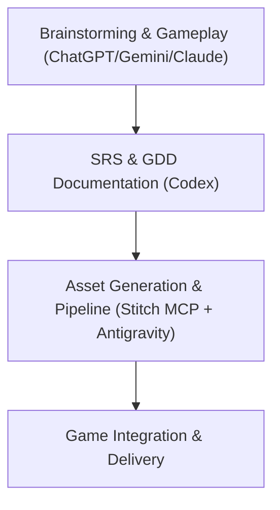
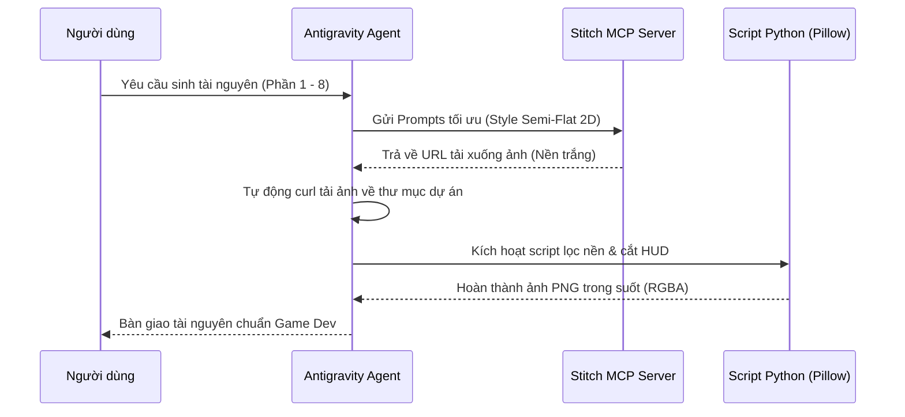

# QUY TRÌNH ÁP DỤNG AI TRONG DỰ ÁN KAIZEN JOURNEY
**Dự án:** VTI 9-Year Adventure - Kaizen Journey  
**Mục đích:** Hướng dẫn chi tiết phương pháp tích hợp trí tuệ nhân tạo (AI) vào toàn bộ vòng đời phát triển game (Game Development Life Cycle - GDLC), từ giai đoạn lên ý tưởng đến thiết kế tài nguyên và đóng gói sản phẩm.

---

---

## 💡 Giai Đoạn 1: Brainstorming & Chốt Thiết Kế Game (Gameplay Options)
**Công cụ sử dụng:** ChatGPT / Gemini / Claude  
**Mục tiêu:** Định hình ý tưởng cốt lõi, cơ chế gameplay, chủ đề thế giới và các giá trị cốt lõi lồng ghép vào game.

### 1. Khảo sát & Đề xuất Ý tưởng
* Dùng các LLMs mạnh về tư duy ngôn ngữ để phân tích đề bài cuộc thi **VTI AI Gameathon 2026** (kỷ niệm 9 năm thành lập VTI, tôn vinh các giá trị cốt lõi: *Tôn trọng, Khách hàng là trên hết, Trách nhiệm, Kaizen*).
* Brainstorming thể loại game phù hợp: Chọn thể loại **Endless Runner 2D side-scrolling** để tối ưu hóa trải nghiệm mượt mà, dễ tiếp cận trên đa nền tảng và dễ lồng ghép các yếu tố văn hóa địa lý (Hà Nội, Tokyo, Đà Nẵng).

### 2. Thiết kế Cơ chế Gameplay & Kaizen Mode
* **Brainstorming hệ thống Core Loop**: Chạy -> Tránh chướng ngại vật -> Thu thập Bình kinh nghiệm (EXP Flask) -> Kích hoạt **Kaizen Mode**.
* **Kaizen Mode**: Thiết kế cơ chế đột phá khi người chơi nạp đầy thanh năng lượng sẽ chuyển sang trạng thái bất tử tạm thời, tăng tốc độ và trang bị bàn phím công nghệ bắn đạn phá hủy chướng ngại vật (biểu tượng cho tinh thần liên tục cải tiến và bứt phá giới hạn).

---

## 📄 Giai Đoạn 2: Xây Dựng Tài Liệu Kỹ Thuật (SRS & GDD)
**Công cụ sử dụng:** Codex (Các mô hình chuyên biệt mã nguồn và tài liệu kỹ thuật)  
**Mục tiêu:** Cụ thể hóa ý tưởng thành tài liệu đặc tả yêu cầu phần mềm (SRS) và tài liệu thiết kế game (GDD) chuẩn công nghiệp.

### 1. Xây dựng tài liệu SRS (Software Requirement Specifications)
* Codex hỗ trợ phác thảo kiến trúc hệ thống:
  * Front-end: **Next.js** (React) cho khả năng tối ưu SEO, hiệu năng load trang nhanh và bảo mật tốt.
  * Back-end/Database: **Supabase** quản lý cơ sở dữ liệu thời gian thực, lưu trữ bảng xếp hạng (Leaderboard) và tích hợp Google SSO.
  * Game Engine: **HTML5 Canvas / Vanilla JS** để kiểm soát pixel hoàn hảo và hiệu năng mượt mà 60 FPS trên trình duyệt.

### 2. Chi tiết hóa GDD (Game Design Document)
* Cấu trúc chi tiết thế giới game thành 3 chặng hành trình tương ứng 3 văn phòng VTI:
  * **Map 1: Hà Nội** - Tượng trưng cho giá trị cốt lõi **Tôn trọng (Respect)** (Bối cảnh Hồ Gươm, Phố cổ, Boss Deadline Cổ Phố).
  * **Map 2: Tokyo** - Tượng trưng cho giá trị cốt lõi **Khách hàng là trên hết & Trách nhiệm** (Bối cảnh hoa anh đào, shinkansen, đèn neon).
  * **Map 3: Đà Nẵng** - Tượng trưng cho giá trị cốt lõi **Kaizen** (Bối cảnh biển Mỹ Khê, Cầu Rồng, công nghệ tương lai).
* Đặc tả chi tiết thông số Mascot, Kẻ địch (Bug Tắc Đường, Bug Trì Hoãn), Chướng ngại vật và Boss để chuẩn bị cho khâu sinh tài nguyên.

---

## 🎨 Giai Đoạn 3: Thiết Kế & Xử Lý Tài Nguyên (Stitch MCP + Antigravity)
**Công cụ sử dụng:** Stitch MCP Server kết hợp Agent Antigravity  
**Mục tiêu:** Tự động hóa hoàn toàn quy trình thiết kế, tải xuống và xử lý hậu kỳ (transparency) cho toàn bộ 30 tài nguyên đồ họa bản đồ Hà Nội.

### 1. Quy trình sinh ảnh bằng Stitch MCP qua Antigravity
* **Định hình Art Style**: Đặt tiêu chuẩn thống nhất **Premium semi-flat 2D**, sử dụng đường nét sắc nét (crisp outline), màu sắc tương phản cao hỗ trợ phản xạ người chơi, tích hợp nhận diện thương hiệu VTI.
* **Tối ưu hóa Prompts**: Viết các prompt chi tiết yêu cầu sprite sheet hoạt hoạt trên nền trắng đơn sắc (solid white background) để phục vụ cho việc lọc tách nền tự động.

### 2. Quy trình xử lý hậu kỳ tự động hóa (Post-processing Pipeline)
* **Tách nền trong suốt (Transparency)**: Antigravity tự động viết và chạy script Python sử dụng thư viện `Pillow` để lọc bỏ nền trắng đặc của các sprite sheet (Mascot, Items, Enemies, Boss, Obstacles) thành ảnh PNG trong suốt hệ màu RGBA 8-bit, giữ nguyên hiệu ứng tỏa sáng (tech glow) mềm mịn.
* **Cắt ghép HUD tự động (HUD Slicing & Trimming)**:
  * Sinh toàn bộ 5 biểu tượng HUD trên một dải ảnh ngang duy nhất (`hanoi_hud_icons_sheet.png`).
  * Sử dụng script Python phân tích pixel để tự động cắt thành 5 biểu tượng riêng biệt, đồng thời xén biên dư thừa (trim) để tối ưu kích thước file (tiết kiệm hơn 5 lần dung lượng lưu trữ).
* **Thiết kế Cảnh chuyển chuyên nghiệp (Empty Cutscene Backgrounds)**:
  * Sinh các cảnh nền cutscene **hoàn toàn trống** ở tiền cảnh.
  * Mascot sẽ được game engine vẽ đè lên tại runtime giúp tăng tính nhất quán và giảm dung lượng tài nguyên.

---

## 📊 Tổng Kết Hiệu Quả Áp Dụng AI
1. **Rút ngắn thời gian phát triển**: Giảm thiểu thời gian chuẩn bị tài nguyên đồ họa từ **2-3 tuần** xuống chỉ còn **vài giờ làm việc**.
2. **Đồng nhất chất lượng**: Đảm bảo art style bán phẳng cao cấp (premium semi-flat 2D) đồng bộ xuyên suốt từ hình nền, chướng ngại vật đến nhân vật chạy và trùm cuối.
3. **Tối ưu hóa lập trình**: Quy trình lọc trong suốt và tự động cắt sprite sheet giúp lập trình viên có thể nạp ngay tài nguyên vào game engine mà không cần bất kỳ bước chỉnh sửa thủ công nào bằng Photoshop.
