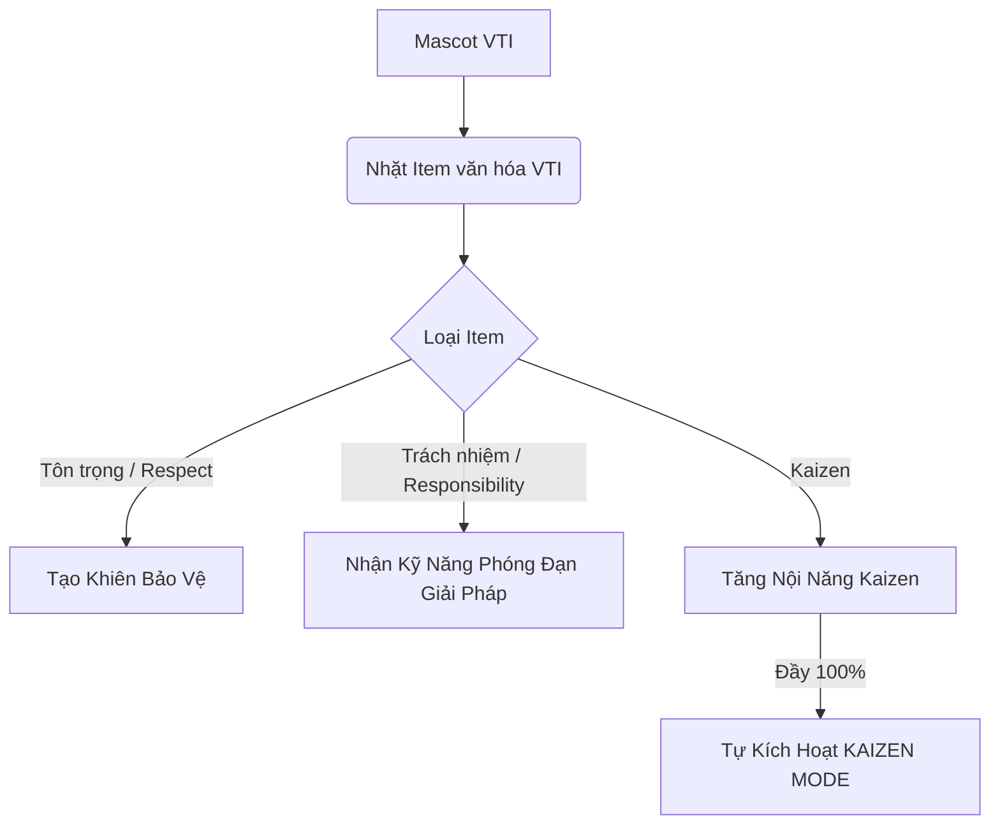

# TÀI LIỆU CHI TIẾT: CƠ CHẾ GAMEPLAY (CORE MECHANICS)
**Dự án:** VTI 9-Year Adventure - Kaizen Journey | **Đội thi:** Kaizen Delivery Squad

---

Tài liệu này đặc tả chi tiết các cơ chế gameplay, vật lý, điều khiển và tương tác giữa các thực thể trên HTML5 Canvas API thuần dành cho các lập trình viên.

---

## 1. HỆ THỐNG ĐIỀU KHIỂN & VẬT LÝ CANVAS (CONTROLS & PHYSICS)

Game chạy trên vòng lặp `requestAnimationFrame` đảm bảo mượt mà (mục tiêu 60 FPS), tính toán dựa trên tọa độ $(x, y)$ của Canvas.

### A. Hệ thống phím điều khiển
*   **Di chuyển trái:** Phím `ArrowLeft` hoặc phím `A`.
*   **Di chuyển phải:** Phím `ArrowRight` hoặc phím `D`.
*   **Nhảy / Nhảy đúp:** Phím `Space` (Phím cách) hoặc `ArrowUp` hoặc `W`.
*   **Bắn đạn giải pháp:** Phím `J` hoặc `X` (chỉ khi có Power-up *Responsibility*).

### B. Mô hình Vật lý 2D Platformer
Nhân vật chịu tác động của lực gia tốc trọng lực, lực cản/ma sát ngang và tốc độ giới hạn để tránh nhân vật rơi quá nhanh hoặc trôi ra ngoài màn hình.

*   **Hằng số vật lý (Đề xuất mặc định):**
    *   Trọng lực (`gravity`): $0.5 \text{ px/frame}^2$
    *   Ma sát ngang (`friction`): $0.85$ (áp dụng khi người chơi thả phím di chuyển)
    *   Gia tốc di chuyển (`acceleration`): $0.8 \text{ px/frame}^2$
    *   Tốc độ di chuyển tối đa (`maxSpeed`): $6 \text{ px/frame}$
    *   Lực nhảy lần 1 (`jumpForce`): $-12 \text{ px/frame}$
    *   Lực nhảy lần 2 (`doubleJumpForce`): $-10 \text{ px/frame}$

*   **Công thức cập nhật Logic (Hàm `update()`):**
    ```typescript
    // 1. Áp dụng ma sát ngang khi không nhấn phím di chuyển ngang
    if (!keys.left && !keys.right) {
        player.vx *= friction;
        if (Math.abs(player.vx) < 0.1) player.vx = 0;
    } else if (keys.left) {
        player.vx = Math.max(player.vx - acceleration, -maxSpeed);
    } else if (keys.right) {
        player.vx = Math.min(player.vx + acceleration, maxSpeed);
    }

    // 2. Áp dụng trọng lực khi đang lơ lửng trên không
    if (!player.onGround) {
        player.vy += gravity;
    } else {
        player.vy = 0;
        player.doubleJumpAvailable = true; // Reset lượt nhảy đúp khi chạm đất
    }

    // 3. Cập nhật tọa độ
    player.x += player.vx;
    player.y += player.vy;
    ```

---

## 2. HỆ THỐNG VA CHẠM & CHIẾN ĐẤU (COLLISION & COMBAT)

### A. Va chạm hộp chữ nhật (AABB Collision)
Mọi thực thể (Nhân vật, Bug, Mảnh ghép, Nền đất) đều được định nghĩa bằng một khung giới hạn (Bounding Box) có tọa độ $(x, y)$, chiều rộng `width` và chiều cao `height`.

```typescript
function checkCollision(rect1: any, rect2: any): boolean {
    return rect1.x < rect2.x + rect2.width &&
           rect1.x + rect1.width > rect2.x &&
           rect1.y < rect2.y + rect2.height &&
           rect1.y + rect1.height > rect2.y;
}
```

### B. Cơ chế Giẫm đầu (Stomp) - Tiêu diệt Bug mặc định
Để xác định nhân vật nhảy lên đầu và tiêu diệt Bug thay vì va chạm mất mạng, game áp dụng kiểm tra vận tốc rơi và vị trí tương đối:

*   **Điều kiện Stomp thành công:**
    1.  Có va chạm xảy ra giữa nhân vật (`player`) và Bug (`enemy`).
    2.  Nhân vật đang di chuyển đi xuống (`player.vy > 0`).
    3.  Đáy của nhân vật trước khi cộng vận tốc nằm trên đỉnh của kẻ địch: 
        $$\text{player.y} + \text{player.height} - \text{player.vy} \le \text{enemy.y}$$

*   **Xử lý Logic:**
    ```typescript
    if (checkCollision(player, enemy)) {
        if (player.vy > 0 && (player.y + player.height - player.vy) <= enemy.y + 5) {
            // Giẫm đầu thành công!
            enemy.isDead = true; // Kích hoạt trạng thái chết của Bug
            player.vy = -8;     // Nẩy nhẹ nhân vật lên
            player.gainKaizenEnergy(10); // Tăng 10% thanh Kaizen
            score += 100;       // Tăng điểm số
        } else {
            // Va chạm thông thường -> Nhận sát thương
            player.takeDamage();
        }
    }
    ```

---

## 3. CHI TIẾT CƠ CHẾ 3 POWER-UPS (CORE VALUES)

Hệ thống bổ trợ (Power-ups) được thiết kế xoay quanh 3 Giá trị cốt lõi của VTI:



### A. Tôn trọng (Respect - Shield Item)
*   **Mô tả:** Khi nhặt được icon hình **Khiên Tôn Trọng** (lá chắn sáng màu lục neon).
*   **Hiệu ứng:** 
    *   Tạo một vòng tròn hào quang bao quanh nhân vật.
    *   Đặt biến `player.hasShield = true`.
*   **Cơ chế bảo vệ:** 
    *   Khi nhân vật va chạm với Bug hoặc chướng ngại vật sát thương thông thường mà có khiên bảo vệ, khiên sẽ vỡ (`player.hasShield = false`).
    *   Nhân vật nhận 1 giây bất tử tạm thời (nhấp nháy sprite) để tránh bị dính sát thương liên tiếp, không bị mất mạng.

### B. Trách nhiệm (Responsibility - Technology Projectiles)
*   **Mô tả:** Khi nhặt được icon hình **Giải pháp Công nghệ** (tia sét/đĩa bay màu xanh dương).
*   **Hiệu ứng:** 
    *   Nhân vật đổi màu neon sáng xanh dương trên trang phục hoặc phụ kiện đeo tay phát sáng.
    *   Nhận khả năng phóng đạn giải pháp.
*   **Cơ chế phóng đạn:**
    *   Khi nhấn phím `J` hoặc `X`, tạo ra một thực thể `Projectile` từ tọa độ nhân vật:
        ```typescript
        const bullet = {
            x: player.facingRight ? player.x + player.width : player.x - 10,
            y: player.y + player.height / 2 - 5,
            vx: player.facingRight ? 10 : -10, // Bay theo hướng nhân vật đứng
            vy: 0,
            width: 15,
            height: 10,
            color: '#00D2FF'
        };
        ```
    *   Đạn bay thẳng trên màn hình. Nếu va chạm với Bug hoặc vật cản phá hủy được, cả đạn và mục tiêu đều biến mất.
    *   Thời gian hồi chiêu giữa mỗi lần bắn: $300 \text{ ms}$ (ngăn chặn spam đạn).

### C. Kaizen (Kaizen Energy & Kaizen Mode)
*   **Mô tả:** Thu thập các **Mảnh Lịch Sử VTI** hoặc tiêu diệt Bug sẽ tăng năng lượng Kaizen.
*   **Cơ chế tích lũy:**
    *   Thanh năng lượng (`kaizenEnergy`) có giá trị từ $0$ đến $100$.
    *   Nhặt 1 Mảnh lịch sử: $+25$ năng lượng.
    *   Tiêu diệt 1 Bug (Stomp/Bắn đạn): $+10$ năng lượng.
*   **Kích hoạt Kaizen Mode:**
    *   Khi thanh năng lượng đạt đúng $100$, trạng thái **Kaizen Mode** tự động kích hoạt trong thời gian $5$ giây.
    *   **Hiệu quả trạng thái cực hạn:**
        *   Nhân vật trở nên bất tử hoàn toàn (`player.isInvincible = true`).
        *   Tốc độ di chuyển tăng gấp đôi (`maxSpeed = 12`).
        *   Hiệu ứng hình ảnh đặc biệt: Hào quang cầu vồng phát sáng chạy dọc nhân vật, để lại bóng mờ (Afterimage/Ghost effect) khi di chuyển.
        *   **Tự động dọn dẹp:** Mọi Bug hoặc vật cản trên đường đi của nhân vật trong trạng thái này đều bị phá hủy ngay lập tức khi chạm vào mà không cần nhảy giẫm đầu, mang lại cảm giác bứt phá tốc độ vượt trội.
    *   Sau $5$ giây, thanh năng lượng reset về $0$ và các chỉ số trở lại bình thường.

---

## 4. CƠ CHẾ KẾT THÚC MÀN CHƠI (GOAL & FLAGPOLE)

*   **Biểu tượng:** Điểm cuối mỗi màn chơi là một cột cờ có cắm **Lá cờ Logo VTI Group** phát sáng.
*   **Điều kiện chiến thắng màn:** Nhân vật chạm vào cột cờ.
*   **Trình tự xử lý chiến thắng:**
    1.  Khóa điều khiển của người chơi, nhân vật tự động thực hiện hoạt ảnh trượt cờ xuống hoặc giơ tay ăn mừng.
    2.  Tính điểm thưởng thời gian chơi còn dư: 
        $$\text{Time Bonus} = \text{Thời gian dư (giây)} \times 10 \text{ điểm}$$
    3.  Tính điểm thu thập mảnh lịch sử:
        $$\text{Fragment Bonus} = \text{Số mảnh nhặt được} \times 500 \text{ điểm}$$
    4.  Hiển thị pop-up bảng thông báo kết quả (Victory Screen) được thiết kế theo phong cách Glassmorphism sang trọng.
    5.  Tự động gửi kết quả điểm và thời gian lên server database của **Supabase** để cập nhật bảng xếp hạng.
    6.  Mở khóa màn chơi tiếp theo (từ Hà Nội sang Đà Nẵng, từ Đà Nẵng sang Tokyo).
