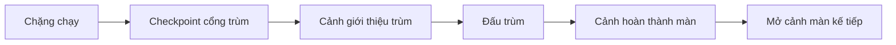
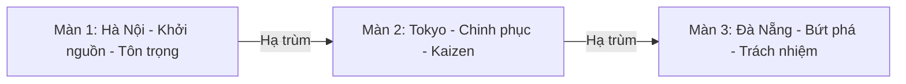

# TÀI LIỆU CHI TIẾT: THIẾT KẾ THẾ GIỚI & MÀN CHƠI
**Dự án:** VTI 9-Year Adventure - Kaizen Journey | **Đội thi:** Kaizen Delivery Squad

---

> Tài liệu này thuộc GDD và tập trung vào thiết kế thế giới, màn chơi và mỹ thuật. Các yêu cầu kỹ thuật và luật gameplay bắt buộc nằm tại [SRS](../SRS/SRS.md). Danh sách frame/prompt tài nguyên Stitch nằm tại [02_Stitch_Asset_Plan.md](./02_Stitch_Asset_Plan.md).

Tài liệu này đặc tả bối cảnh nghệ thuật, nhịp độ gameplay, kẻ địch, trùm, vật phẩm và cảnh chuyển cho 3 màn chạy ngang: **Hà Nội**, **Tokyo**, **Đà Nẵng**. Các màn cùng dùng chung hệ cơ chế chạy tự động, nhảy/cúi/bay, bình kinh nghiệm, Bug, trùm, Khiên Tôn trọng, Cánh Trách nhiệm và Chế độ Kaizen.

---

## ĐỊNH HƯỚNG MỸ THUẬT: BẢN SẮC VĂN HÓA & CÔNG NGHỆ ĐỊA PHƯƠNG

*   **Không dùng cyberpunk chung chung:** Tránh nền tối, neon quá nặng và hình ảnh viễn tưởng không gắn với VTI.
*   **Văn hóa địa phương kết hợp công nghệ VTI:** Mỗi màn phải thể hiện rõ địa phương, văn hóa, văn phòng VTI và tinh thần công nghệ hiện đại.
*   **Dễ đọc khi chạy tốc độ cao:** Vật phẩm, kẻ địch và chướng ngại phải có dáng nhận diện rõ, màu tương phản với nền và tín hiệu cảnh báo trước khi gây sát thương.
*   **Sẵn sàng cho Stitch:** Tất cả vật phẩm chính cần tuân thủ skill art riêng tại `.skills/item_art_style_stitch.md`.

---

## CẤU TRÚC CHUNG CỦA MỖI MÀN

### A. Chặng Chạy
*   Nhân vật tự động chạy về bên phải.
*   Người chơi thu thập bình kinh nghiệm theo cụm parabol ngược, né Hố sâu/Bom, tiêu diệt Bug mặt đất bằng cách giẫm đầu và chuẩn bị Nội năng Kaizen cho phần đấu trùm.

### B. Đấu Trùm
*   Trùm chạy cùng tốc độ với người chơi ở phía trước màn hình.
*   Trùm liên tục bắn đạn nhiều quỹ đạo.
*   Người chơi cần dùng Chế độ Kaizen để bắn đạn "Tab"/"Enter" gây sát thương trùm.

### C. Cảnh Chuyển
*   **Giới thiệu trùm:** Hiện hình trùm, tên trùm, câu thoại thử thách và kích hoạt checkpoint.
*   **Hoàn thành màn:** Tóm tắt hành trình vừa vượt qua, điểm số và một mốc phát triển trong lịch sử VTI.
*   **Mở cảnh màn kế tiếp:** Mở cảnh chuyển địa phương tiếp theo.

---

## LỘ TRÌNH 3 MÀN & ĐỘ KHÓ

| Màn | Tốc độ nền | Mật độ chướng ngại | Trọng tâm kỹ năng | Trùm |
| --- | --- | --- | --- | --- |
| Hà Nội | Thấp | Thấp - vừa | Nhảy đúng nhịp, cúi né Bom, học giẫm đầu Bug | Boss Deadline Cổ Phố |
| Tokyo | Vừa | Vừa - cao | Đọc tín hiệu cảnh báo, xử lý Bug bay, dùng Kaizen đúng thời điểm | Boss Kaizen Breaker |
| Đà Nẵng | Cao | Cao | Kết hợp nhảy/cúi/bay, né Bom dù dày, bắn trùm trong áp lực cao | Boss Data Storm Dragon |

---

## MÀN 1: HÀ NỘI - KHỞI NGUỒN GIÁ TRỊ (TÔN TRỌNG)

*   **Thông điệp truyền tải:** VTI khởi nguồn từ Hà Nội với văn hóa **Tôn trọng** đối tác, khách hàng và đồng nghiệp.
*   **Vai trò gameplay:** Màn nhập môn cho lối chơi chạy ngang; dạy nhảy qua Hố sâu, cúi qua Bom, giẫm đầu Bug mặt đất và nhặt cụm bình kinh nghiệm.
*   **Tông màu chủ đạo:** Vàng hoàng hôn cổ kính, cam ấm, xanh Hồ Gươm và điểm nhấn đỏ VTI.

### A. Lớp Nền
*   **Nền xa:** Tháp Rùa Hồ Gươm, cầu Thê Húc, hàng liễu và mặt hồ phản chiếu.
*   **Nền giữa:** Phố cổ Hà Nội, cột cờ Hà Nội, tòa nhà VTI Hà Nội có logo sáng.
*   **Nền gần:** Nền gạch xám cổ, khóm hoa, ghế trà đá, biển chỉ dẫn VTI 9 năm.

### B. Mascot & Chủ Đề Vật Phẩm
*   **Mascot:** Áo dài cách tân đỏ viền vàng, giày thể thao, tai nghe công nghệ.
*   **Bình kinh nghiệm:** Bình thủy tinh nhỏ có họa tiết sóng Hồ Gươm, nắp đỏ VTI, lõi sáng vàng.
*   **Khiên Tôn trọng:** Khiên họa tiết hoa sen/cầu Thê Húc, glow xanh lục dịu.
*   **Cánh Trách nhiệm:** Cánh công nghệ đơn giản, motif nan tre và viền xanh lam.
*   **Bàn phím Kaizen:** Bàn phím compact có keycap đỏ/vàng, hiệu ứng ký tự "Tab"/"Enter" dạng thư pháp số.

### C. Kẻ Địch & Chướng Ngại
*   **Bug mặt đất - Bug Tắc Đường:** Di chuyển chậm, hitbox lớn, dạy người chơi giẫm đầu.
*   **Bug bay - Bug Trì Hoãn:** Bay thấp, bắn đạn đồng hồ lỗi theo đường thẳng chậm.
*   **Hố sâu:** Vết nứt trên mặt đường gạch, cảnh báo bằng bụi và biển cảnh báo nhỏ.
*   **Bom:** Bom treo thấp như túi hàng/rào công trình, yêu cầu cúi để qua.

### D. Đấu Trùm
*   **Trùm:** Boss Deadline Cổ Phố.
*   **Hình ảnh:** Cỗ máy đồng hồ lớn phủ giấy note deadline, bánh răng kẹt và đèn đỏ nhấp nháy.
*   **Pattern đạn:** Đạn thẳng chậm, đạn parabol thấp, một loạt đạn báo trước bằng điểm đánh dấu đỏ.
*   **Mục tiêu độ khó:** Người chơi có thể hoàn thành nếu biết tích Kaizen, nhảy/cúi cơ bản và bắn đúng nhịp.

### E. Cảnh Chuyển Sau Màn
*   Kể về giai đoạn khởi nguồn của VTI, tinh thần tôn trọng trong hợp tác và nền móng văn hóa đội ngũ.
*   Cảnh mở đầu tiếp theo: Mascot lên chuyến bay quốc tế hướng tới Tokyo, đường chân trời chuyển dần sang hoa anh đào và biển quảng cáo LED.

---

## MÀN 2: TOKYO - CHINH PHỤC TOÀN CẦU (KAIZEN)

*   **Thông điệp truyền tải:** VTI chinh phục thị trường Nhật Bản bằng tinh thần học hỏi, kỷ luật và **Kaizen** mỗi ngày.
*   **Vai trò gameplay:** Màn độ khó trung bình; tăng tốc so với Hà Nội, bắt đầu yêu cầu đọc tín hiệu cảnh báo rõ hơn, xử lý Bug bay và dùng Chế độ Kaizen đúng thời điểm.
*   **Tông màu chủ đạo:** Hồng hoa anh đào, trắng tuyết, đỏ mặt trời, xanh công nghệ và ánh LED Tokyo.

### A. Lớp Nền
*   **Nền xa:** Núi Phú Sĩ, mặt trời đỏ, Tokyo Tower.
*   **Nền giữa:** Ngã tư Shibuya, màn hình LED VTI 9 năm, văn phòng VTI Japan.
*   **Nền gần:** Vạch đường Shibuya, nền đá sân đền, hoa anh đào rơi, biển chỉ dẫn song ngữ.

### B. Mascot & Chủ Đề Vật Phẩm
*   **Mascot:** Kimono cách tân hoặc business casual high-tech, dải năng lượng sau lưng.
*   **Bình kinh nghiệm:** Bình pha lê hình búp hoa anh đào, lõi hồng/trắng, hiệu ứng cánh hoa.
*   **Khiên Tôn trọng:** Khiên họa tiết cánh hoa và mặt trời đỏ.
*   **Cánh Trách nhiệm:** Cánh origami công nghệ, viền sáng trắng/xanh.
*   **Bàn phím Kaizen:** Bàn phím Nhật-VTI, keycap tối giản, đạn "Tab"/"Enter" có vệt hoa anh đào số hóa.

### C. Kẻ Địch & Chướng Ngại
*   **Bug mặt đất - Overtime Bug:** Chạy trên mặt đất, ném giấy tờ làm tín hiệu cảnh báo nhưng vẫn phải giẫm đầu để tiêu diệt.
*   **Bug bay - Language Barrier Bug:** Bay cao, bắn ký tự lỗi font theo quỹ đạo chéo vừa phải.
*   **Hố sâu:** Khe nứt giữa đường Shibuya/ga tàu, có đèn cảnh báo đỏ.
*   **Bom:** Bom an ninh treo thấp và Bom dù trên không, pattern xen kẽ nhưng khoảng nghỉ còn rõ để người chơi học nhịp.

### D. Đấu Trùm
*   **Trùm:** Boss Kaizen Breaker.
*   **Hình ảnh:** Thực thể lỗi hệ thống khổng lồ mặc giáp công sở, mang lõi phản-Kaizen và màn hình báo lỗi.
*   **Pattern đạn:** Đạn thẳng nhanh vừa, đạn chùm hẹp, đạn rơi theo điểm đánh dấu và một số đạn parabol.
*   **Mục tiêu độ khó:** Kiểm tra khả năng đọc tín hiệu cảnh báo, giữ máu và dùng Chế độ Kaizen chính xác, nhưng chưa dày đặc như màn cuối Đà Nẵng.

### E. Cảnh Chuyển Sau Màn
*   Kể về bước tiến ra thị trường Nhật Bản, tinh thần học hỏi, kỷ luật và cải tiến liên tục của VTI.
*   Cảnh mở đầu tiếp theo: Mascot trở về Việt Nam, đường bay chuyển về bờ biển Đà Nẵng và Cầu Rồng, nhạc nâng tempo rõ rệt.

---

## MÀN 3: ĐÀ NẴNG - BỨT PHÁ CÔNG NGHỆ (TRÁCH NHIỆM)

*   **Thông điệp truyền tải:** VTI Đà Nẵng đại diện tinh thần **Trách nhiệm**, chủ động nhận việc khó và bứt phá trong triển khai công nghệ.
*   **Vai trò gameplay:** Màn cuối có tốc độ cao nhất, pattern dày nhất, nhiều đoạn bay bằng Cánh Trách nhiệm, Bom dù trên không và Bug bay bắn đạn áp lực cao.
*   **Tông màu chủ đạo:** Xanh đại dương, vàng cát, cam nắng và trắng sáng.

### A. Lớp Nền
*   **Nền xa:** Cầu Rồng, sông Hàn, Ngũ Hành Sơn.
*   **Nền giữa:** Bãi biển Mỹ Khê, Sun Wheel, văn phòng VTI Đà Nẵng.
*   **Nền gần:** Sàn gỗ ven biển, bờ cát, phao cứu hộ, vỏ sò phát sáng.

### B. Mascot & Chủ Đề Vật Phẩm
*   **Mascot:** Áo polo xanh VTI, quần thể thao, smart visor.
*   **Bình kinh nghiệm:** Bình dạng giọt nước/pha lê biển, lõi xanh cyan, hiệu ứng bong bóng nhỏ.
*   **Khiên Tôn trọng:** Khiên hình phao cứu hộ công nghệ.
*   **Cánh Trách nhiệm:** Cánh phản lực lấy cảm hứng từ Cầu Rồng, glow xanh/cam.
*   **Bàn phím Kaizen:** Bàn phím chống nước, keycap cyan/cam, đạn "Tab"/"Enter" như sóng dữ liệu.

### C. Kẻ Địch & Chướng Ngại
*   **Bug mặt đất - Low Battery Bug:** Pin cạn nằm trên đường, có xung điện ngắn; chỉ giẫm đầu khi xung tắt.
*   **Bug bay - Data Leak Bug:** Bay zigzag nhanh, bắn đạn dữ liệu theo nhịp dày hơn Tokyo.
*   **Hố sâu:** Khe nứt giữa cầu/sàn gỗ, có hiệu ứng sóng dưới đáy.
*   **Bom:** Bom treo dù trên trời trong đoạn bay và Bom thấp trên mặt đất xuất hiện xen kẽ nhanh, buộc người chơi đổi trạng thái liên tục.

### D. Đấu Trùm
*   **Trùm:** Boss Data Storm Dragon.
*   **Hình ảnh:** Rồng dữ liệu lấy cảm hứng Cầu Rồng, thân tạo bởi packet dữ liệu và đèn LED.
*   **Pattern đạn:** Đạn chùm hình quạt rộng, đạn zigzag nhanh, đạn mưa dữ liệu rơi từ trên xuống và loạt đạn ngắn trong đoạn bay.
*   **Mục tiêu độ khó:** Kiểm tra toàn bộ kỹ năng: nhảy/cúi chính xác, bay/hạ độ cao, giữ máu, tận dụng Khiên Tôn trọng và bắn trùm trong Chế độ Kaizen dưới áp lực cao nhất.

### E. Cảnh Chuyển Kết Thúc Hành Trình
*   Tổng kết hành trình 9 năm VTI từ khởi nguồn, chinh phục thị trường quốc tế đến bứt phá trách nhiệm trong triển khai công nghệ.
*   Hiển thị tổng điểm hành trình, thứ hạng cá nhân/phòng ban và thông điệp: **"VTI 9 Năm - Công nghệ kiến tạo giá trị mới"**.

---

## BẢNG ÂM THANH THEO MÀN

| Màn | Nhạc chặng chạy | Nhạc đấu trùm | Hiệu ứng âm thanh điểm nhấn |
| --- | --- | --- | --- |
| Hà Nội | Giai điệu ấm, tempo vừa, nhạc cụ truyền thống nhẹ + synth | Bản phối căng hơn với tiếng đồng hồ và trống thấp | Chuông nhỏ khi nhặt bình, tiếng khiên sen, bánh răng trùm |
| Tokyo | Điện tử tempo vừa-cao, motif hoa anh đào và city pop nhẹ | Nhạc trùm dồn dập nhưng còn khoảng nghỉ rõ | Tiếng keycap "Tab"/"Enter", lỗi font, cảnh báo Shibuya |
| Đà Nẵng | Tempo nhanh nhất, nhịp gõ gợi biển, synth sáng | Lớp âm rồng dữ liệu, bass mạnh và tiếng gió áp lực cao | Bong bóng dữ liệu, tiếng cánh phản lực, đạn packet |
