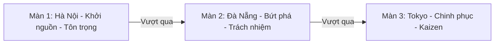

# TÀI LIỆU CHI TIẾT: THIẾT KẾ THẾ GIỚI & MÀN CHƠI (WORLD DESIGN & LEVELS)
**Dự án:** VTI 9-Year Adventure - Kaizen Journey | **Đội thi:** Kaizen Delivery Squad

---

Tài liệu này đặc tả chi tiết bối cảnh nghệ thuật, thiết kế màn chơi, trang phục của Mascot và các thực thể đặc trưng tương ứng với 3 địa điểm cứ điểm lớn của VTI: Hà Nội, Đà Nẵng, và Tokyo.

---

## ĐỊNH HƯỚNG MỸ THUẬT: BẢN SẮC VĂN HÓA & CÔNG NGHỆ ĐỊA PHƯƠNG
*   **Không Cyberpunk chung chung:** Loại bỏ toàn bộ phong cách viễn tưởng Cyberpunk tối tăm phổ biến.
*   **Vocal Cultural & Local Tech Integration:** Lồng ghép hình ảnh danh lam thắng cảnh, văn hóa ẩm thực và đời sống đặc trưng của từng địa phương, kết hợp khéo léo với giao diện công nghệ dạng kính mờ (Glassmorphism), gradient màu sắc tươi sáng của VTI để tạo nên nét cao cấp và độc bản.

---

## CHI TIẾT THIẾT KẾ CÁC MÀN CHƠI (LEVELS)

---

### MÀN 1: HÀ NỘI - KHỞI NGUỒN GIÁ TRỊ (RESPECT MAP)

*   **Thông điệp truyền tải:** VTI xuất phát từ cái nôi Hà Nội với văn hóa **Tôn trọng (Respect)** đối tác, khách hàng và đồng nghiệp.
*   **Số lượng Mảnh ghép Lịch sử:** 3 Mảnh (Mảnh số 1, 2, và 3).
*   **Tông màu chủ đạo:** Vàng hoàng hôn cổ kính pha sắc cam ấm áp và lục bình yên của Hồ Gươm.

#### A. Thiết kế Bối cảnh (Background Layers)
*   **Lớp xa (Far Background):** Tháp Rùa Hồ Gươm ẩn hiện, cầu Thê Húc đỏ son rực rỡ, hàng liễu rủ bóng bên hồ.
*   **Lớp trung (Midground):** Các dãy nhà cổ kính mái ngói đỏ của Phố cổ Hà Nội, ban công treo hoa giấy, kết hợp cột cờ Hà Nội và tòa nhà trụ sở VTI Hà Nội với logo VTI thắp sáng rực rỡ.
*   **Lớp cận (Foreground):** Nền đất lát gạch xám cổ kính, các khóm hoa cúc vàng rực, quán trà đá vỉa hè.

#### B. Trang phục Mascot VTI (Skin)
*   **Diện mạo:** Mascot mặc bộ **Áo dài cách tân** màu đỏ viền vàng năng động (hoặc áo thun đỏ sao vàng cách điệu), đi giày thể thao hiện đại, tai đeo tai nghe công nghệ màu vàng phát sáng.

#### C. Kẻ địch & Bẫy địa hình đặc trưng
*   **Kẻ địch (Bug):**
    *   *Bug Tắc Đường:* Thiết kế hình chiếc xe máy hoặc đám khói Bug màu xám di chuyển qua lại chậm chạp nhưng chiếm diện tích lớn, buộc người chơi phải căn thời gian nhảy qua.
    *   *Bug Trì Hoãn:* Quái vật Bug dạng chiếc đồng hồ báo thức bị hỏng. Nếu chạm vào, nhân vật bị làm chậm tốc độ chạy đi 50% trong 2 giây.
*   **Bẫy địa hình (Traps):**
    *   *Bẫy Dây Điện Chằng Chịt:* Các dây điện giăng ngang tầm cao. Nhân vật chạm vào sẽ bị giật điện (mất khiên hoặc mất mạng nếu không có khiên).
    *   *Rào Chắn Công Trình:* Các rào chắn màu vàng/đen nhấp nháy, thu hẹp đường đi của nhân vật.

---

### MÀN 2: ĐÀ NẴNG - BỨT PHÁ CÔNG NGHỆ (RESPONSIBILITY MAP)

*   **Thông điệp truyền tải:** Sức trẻ VTI Đà Nẵng bứt phá với tinh thần **Trách nhiệm (Responsibility)** cao nhất, phóng các giải pháp công nghệ đánh bay thử thách.
*   **Số lượng Mảnh ghép Lịch sử:** 3 Mảnh (Mảnh số 4, 5, và 6).
*   **Tông màu chủ đạo:** Xanh đại dương tươi mát kết hợp vàng cát cháy rực rỡ của năng lượng bứt phá.

#### A. Thiết kế Bối cảnh (Background Layers)
*   **Lớp xa (Far Background):** Cầu Rồng biểu tượng phun nước/lửa hoành tráng bắc qua sông Hàn, Ngũ Hành Sơn hùng vĩ phía xa.
*   **Lớp trung (Midground):** Bãi biển Mỹ Khê với rặng dừa đung đưa, vòng quay Sun Wheel rực sáng nhiều màu, kết hợp tòa nhà văn phòng VTI Đà Nẵng mang kiến trúc hiện đại, xanh ngát.
*   **Lớp cận (Foreground):** Sàn gỗ đi bộ ven biển hoặc bờ cát mịn màu vàng nhạt, điểm xuyết các phao cứu hộ màu cam và vỏ sò phát sáng.

#### B. Trang phục Mascot VTI (Skin)
*   **Diện mạo:** Mascot đổi sang bộ đồ thể thao năng động, phóng khoáng phong cách biển (quần shorts, áo polo thể thao màu xanh dương VTI) phối hợp với kính râm công nghệ cao (Smart Visor) hiển thị chỉ số tọa độ.

#### C. Kẻ địch & Bẫy địa hình đặc trưng
*   **Kẻ địch (Bug):**
    *   *Bug Sập Nguồn (Low Battery Bug):* Quái vật Bug dạng viên pin cạn kiệt, phát ra các xung tia điện nhỏ màu đỏ theo chu kỳ, yêu cầu người chơi phải Stomp khi tia điện tắt hoặc dùng đạn bắn xa từ Power-up Trách nhiệm.
    *   *Bug Rò Rỉ Dữ Liệu (Data Leak Bug):* Bug di chuyển cực nhanh theo chiều ngang, thỉnh thoảng nhảy lên, đòi hỏi phản xạ cực nhạy.
*   **Bẫy địa hình (Traps):**
    *   *Cát Lún Bãi Biển:* Những vũng cát có màu đậm hơn. Nếu đi vào, nhân vật bị lún nhẹ, không thể kích hoạt Nhảy đúp (Double Jump) mà chỉ có thể nhảy đơn.
    *   *Sóng Cuốn Ven Bờ:* Các cơn sóng tràn lên mép nền đất theo chu kỳ, có thể đẩy lùi nhân vật về phía sau nếu không căn thời điểm nhảy tránh.

---

### MÀN 3: TOKYO - CHINH PHỤC TOÀN CẦU (KAIZEN MAP)

*   **Thông điệp truyền tải:** VTI vươn mình ra thế giới, chinh phục thị trường Nhật Bản khó tính nhất bằng tinh thần học hỏi, liên tục cải tiến mỗi ngày **Kaizen**.
*   **Số lượng Mảnh ghép Lịch sử:** 4 Mảnh (Mảnh số 7, 8, 9 và 10).
*   **Tông màu chủ đạo:** Hồng hoa anh đào ngọt ngào pha tím huyền ảo của hoàng hôn Tokyo và ánh sáng Neon rực rỡ của ngã tư Shibuya.

#### A. Thiết kế Bối cảnh (Background Layers)
*   **Lớp xa (Far Background):** Núi Phú Sĩ phủ tuyết trắng xóa lãng mạn dưới ánh mặt trời đỏ rực, tháp Tokyo Tower lung linh.
*   **Lớp trung (Midground):** Ngã tư Shibuya sầm uất với các màn hình LED khổng lồ quảng cáo sinh nhật 9 năm VTI Group, những cánh hoa anh đào bay nhẹ nhàng trong gió, văn phòng VTI Japan hiện đại tọa lạc tại Tokyo.
*   **Lớp cận (Foreground):** Mặt đường Shibuya được kẻ vạch trắng tinh tế, nền đá lát sân đền cổ kính ngập hoa anh đào rụng.

#### B. Trang phục Mascot VTI (Skin)
*   **Diện mạo:** Mascot khoác lên mình bộ **Kimono cách tân cực ngắn** thời thượng phối màu hồng/tím/trắng (hoặc bộ vest công sở high-tech lịch lãm - High-tech Business Casual) kết hợp các dải nơ năng lượng phát sáng rực rỡ sau lưng.

#### C. Kẻ địch & Bẫy địa hình đặc trưng
*   **Kẻ địch (Bug):**
    *   *Bug OT Tối Thượng (Overtime Bug):* Kẻ địch khổng lồ đội mũ công sở mệt mỏi, thỉnh thoảng ném ra các xấp tài liệu/hồ sơ cản đường.
    *   *Bug Bất Đồng Ngôn Ngữ (Language Barrier Bug):* Bug bay lơ lửng, liên tục bắn ra các chùm ký tự lỗi font chéo xuống dưới. Cần giẫm đầu chính xác hoặc né tránh kỹ lưỡng.
*   **Bẫy địa hình (Traps):**
    *   *Laser Bảo Mật Văn Phòng:* Các tia laser màu đỏ quét dọc theo chu kỳ tại các khu vực văn phòng VTI Tokyo. Nhân vật chỉ được đi qua khi tia laser tắt.
    *   *Sàn Sụp Đổ (Collapsible Floor):* Các phiến đá lát ngập hoa anh đào có vết nứt. Khi nhân vật giẫm lên, sàn sẽ sụp đổ sau 0.8 giây, đòi hỏi người chơi phải bứt tốc hoặc nhảy đúp ngay lập tức để vượt qua vực sâu.
