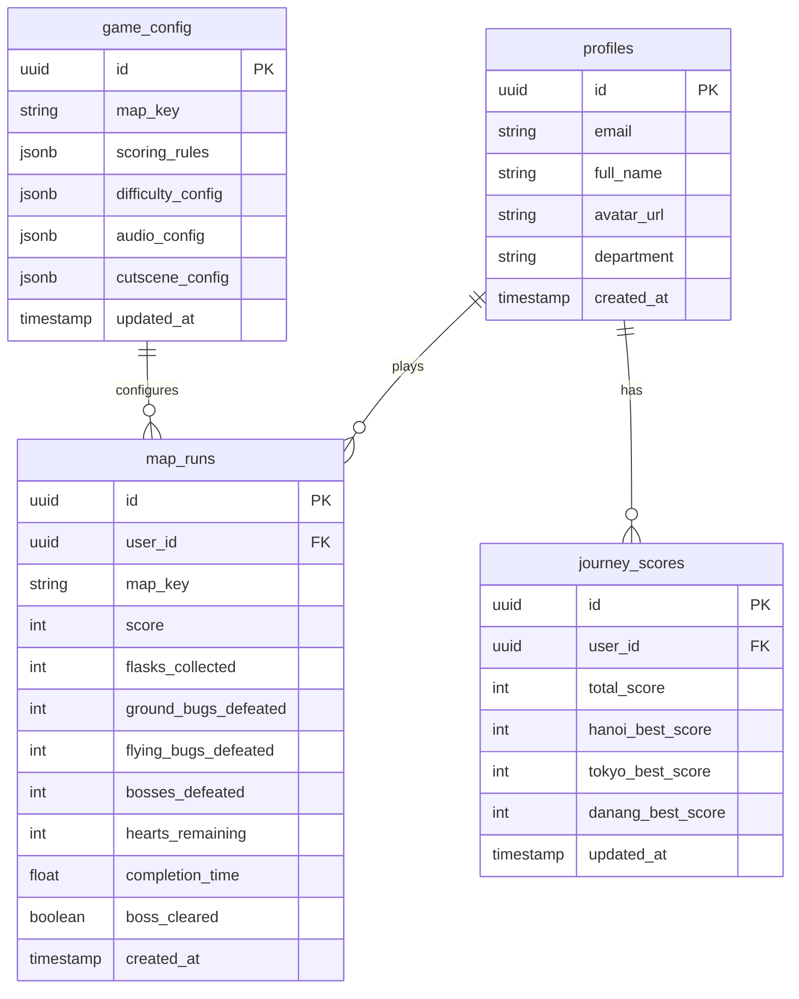

# TÀI LIỆU CHI TIẾT: THÔNG SỐ KỸ THUẬT & HỆ THỐNG (TECHNICAL SPECS)
**Dự án:** VTI 9-Year Adventure - Kaizen Journey | **Đội thi:** Kaizen Delivery Squad

---

Tài liệu này đặc tả kiến trúc mã nguồn, thiết kế Supabase, Google SSO, hệ thống Canvas endless runner, scoring, checkpoint, cutscene và audio mapping trên nền tảng Next.js (App Router).

---

## 1. KIẾN TRÚC MÃ NGUỒN NEXT.JS (APP ROUTER)

Dự án sử dụng Next.js làm framework cốt lõi. Giao diện bao quanh (Dashboard, Login, Leaderboard, Admin) được render phía máy chủ hoặc máy khách tùy nhu cầu, trong khi Game Canvas chạy 100% Client-side.

### Thư mục dự án tiêu chuẩn
```text
/src
  ├── app/
  │    ├── layout.tsx
  │    ├── page.tsx
  │    ├── login/
  │    │    └── page.tsx
  │    ├── game/
  │    │    └── page.tsx
  │    ├── leaderboard/
  │    │    └── page.tsx
  │    └── admin/
  │         └── page.tsx
  ├── components/
  │    ├── GameCanvas.tsx
  │    ├── Hud.tsx
  │    ├── CutsceneOverlay.tsx
  │    ├── Navbar.tsx
  │    └── LeaderboardTable.tsx
  ├── game/
  │    ├── engine/
  │    │    ├── GameLoop.ts
  │    │    ├── InputManager.ts
  │    │    ├── Collision.ts
  │    │    ├── AudioManager.ts
  │    │    └── SceneManager.ts
  │    ├── entities/
  │    │    ├── Player.ts
  │    │    ├── Enemy.ts
  │    │    ├── Boss.ts
  │    │    ├── Projectile.ts
  │    │    ├── Collectible.ts
  │    │    └── Obstacle.ts
  │    ├── maps/
  │    │    ├── hanoi.ts
  │    │    ├── tokyo.ts
  │    │    └── danang.ts
  │    └── scoring.ts
  ├── lib/
  │    ├── supabase.ts
  │    └── utils.ts
  └── styles/
       └── globals.css
```

---

## 2. GAME STATE & ENTITY MODEL

### A. Game state chính
```typescript
type MapKey = "hanoi" | "tokyo" | "danang";
type GamePhase = "runner" | "boss_intro" | "boss" | "map_clear" | "game_over";

interface GameState {
    mapKey: MapKey;
    phase: GamePhase;
    scrollX: number;
    score: number;
    hearts: number;
    checkpoint: "map_start" | "boss";
    kaizenEnergy: number;
    elapsedSeconds: number;
    collectedFlasks: number;
    defeatedGroundBugs: number;
    defeatedFlyingBugs: number;
    defeatedBosses: number;
}
```

### B. Player state
```typescript
interface Player {
    x: number;
    y: number;
    width: number;
    height: number;
    vx: number;
    vy: number;
    previousBottom: number;
    onGround: boolean;
    isCrouching: boolean;
    hasShield: boolean;
    isFlying: boolean;
    isKaizenMode: boolean;
    shieldUntil: number;
    wingsUntil: number;
    kaizenUntil: number;
    shootCooldown: number;
}
```

### C. Entity phân loại
```typescript
type EnemyKind = "ground_bug" | "flying_bug";
type ObstacleKind = "pit" | "bomb";
type CollectibleKind = "experience_flask" | "respect" | "responsibility";

interface Entity {
    id: string;
    x: number;
    y: number;
    width: number;
    height: number;
    isActive: boolean;
}
```

---

## 3. CƠ SỞ DỮ LIỆU SUPABASE SCHEMA

Supabase đóng vai trò Backend-as-a-Service. Schema cần hỗ trợ leaderboard theo map, tổng hành trình, cấu hình map, audio và cutscene.



### A. Bảng `profiles`
```sql
CREATE TABLE profiles (
    id UUID REFERENCES auth.users ON DELETE CASCADE PRIMARY KEY,
    email TEXT UNIQUE NOT NULL,
    full_name TEXT,
    avatar_url TEXT,
    department TEXT NOT NULL,
    created_at TIMESTAMP WITH TIME ZONE DEFAULT TIMEZONE('utc'::text, NOW()) NOT NULL
);
```

### B. Bảng `map_runs`
Lưu từng lượt chơi theo map để xếp hạng map và thống kê gameplay.

```sql
CREATE TABLE map_runs (
    id UUID DEFAULT gen_random_uuid() PRIMARY KEY,
    user_id UUID REFERENCES profiles(id) ON DELETE CASCADE NOT NULL,
    map_key TEXT NOT NULL CHECK (map_key IN ('hanoi', 'tokyo', 'danang')),
    score INTEGER DEFAULT 0 NOT NULL,
    flasks_collected INTEGER DEFAULT 0 NOT NULL,
    ground_bugs_defeated INTEGER DEFAULT 0 NOT NULL,
    flying_bugs_defeated INTEGER DEFAULT 0 NOT NULL,
    bosses_defeated INTEGER DEFAULT 0 NOT NULL,
    hearts_remaining INTEGER DEFAULT 0 NOT NULL,
    completion_time REAL NOT NULL,
    boss_cleared BOOLEAN DEFAULT FALSE NOT NULL,
    created_at TIMESTAMP WITH TIME ZONE DEFAULT TIMEZONE('utc'::text, NOW()) NOT NULL
);

CREATE INDEX map_runs_map_score_idx ON map_runs(map_key, score DESC, completion_time ASC);
CREATE INDEX map_runs_user_map_idx ON map_runs(user_id, map_key, score DESC);
```

### C. Bảng `journey_scores`
Lưu điểm tốt nhất của từng map và tổng hành trình.

```sql
CREATE TABLE journey_scores (
    id UUID DEFAULT gen_random_uuid() PRIMARY KEY,
    user_id UUID REFERENCES profiles(id) ON DELETE CASCADE NOT NULL UNIQUE,
    total_score INTEGER DEFAULT 0 NOT NULL,
    hanoi_best_score INTEGER DEFAULT 0 NOT NULL,
    tokyo_best_score INTEGER DEFAULT 0 NOT NULL,
    danang_best_score INTEGER DEFAULT 0 NOT NULL,
    updated_at TIMESTAMP WITH TIME ZONE DEFAULT TIMEZONE('utc'::text, NOW()) NOT NULL
);

CREATE INDEX journey_scores_total_idx ON journey_scores(total_score DESC);
```

### D. Bảng `game_config`
CMS quản trị map, scoring, cutscene và audio.

```sql
CREATE TABLE game_config (
    id UUID DEFAULT gen_random_uuid() PRIMARY KEY,
    map_key TEXT UNIQUE NOT NULL CHECK (map_key IN ('hanoi', 'tokyo', 'danang')),
    scoring_rules JSONB NOT NULL,
    difficulty_config JSONB NOT NULL,
    audio_config JSONB NOT NULL,
    cutscene_config JSONB NOT NULL,
    cultural_message TEXT NOT NULL,
    updated_at TIMESTAMP WITH TIME ZONE DEFAULT TIMEZONE('utc'::text, NOW()) NOT NULL
);
```

---

## 4. SCORING SERVICE

### A. Quy tắc điểm mặc định
```typescript
export const SCORE_RULES = {
    experienceFlask: 50,
    groundBugDefeated: 150,
    flyingBugDefeated: 200,
    bossDefeated: 2000,
    mapClearBonus: 1000,
    remainingHeartBonus: 300
};
```

### B. Hàm tính điểm map
```typescript
export function calculateMapScore(stats: {
    flasksCollected: number;
    groundBugsDefeated: number;
    flyingBugsDefeated: number;
    bossesDefeated: number;
    heartsRemaining: number;
    bossCleared: boolean;
}) {
    return stats.flasksCollected * SCORE_RULES.experienceFlask
        + stats.groundBugsDefeated * SCORE_RULES.groundBugDefeated
        + stats.flyingBugsDefeated * SCORE_RULES.flyingBugDefeated
        + stats.bossesDefeated * SCORE_RULES.bossDefeated
        + (stats.bossCleared ? SCORE_RULES.mapClearBonus : 0)
        + stats.heartsRemaining * SCORE_RULES.remainingHeartBonus;
}
```

### C. Cập nhật tổng hành trình
*   Khi một map kết thúc, lưu `map_runs`.
*   Nếu score mới cao hơn best score map hiện tại, cập nhật `journey_scores`.
*   `total_score = hanoi_best_score + tokyo_best_score + danang_best_score`.

---

## 5. GOOGLE SSO (VTI EMAIL ONLY)

Để đảm bảo chỉ VTIans tham gia cuộc thi, hệ thống bắt buộc kiểm tra domain email đăng nhập.

```typescript
const handleGoogleLogin = async () => {
    const { error } = await supabase.auth.signInWithOAuth({
        provider: "google",
        options: {
            redirectTo: `${window.location.origin}/auth/callback`,
            queryParams: {
                hd: "vti.com.vn"
            }
        }
    });

    if (error) throw error;
};
```

Tại `/auth/callback`, nếu email không kết thúc bằng `@vti.com.vn`, hệ thống hủy session và redirect về Login với thông báo: `"Vui lòng sử dụng email VTI để đăng nhập"`.

---

## 6. KHUNG COMPONENT CANVAS & CLEANUP

Trong Next.js, Canvas phải chạy ở Client Component và dọn dẹp đầy đủ event listener, animation frame, audio loop.

```typescript
"use client";

import React, { useEffect, useRef } from "react";

export default function GameCanvas() {
    const canvasRef = useRef<HTMLCanvasElement | null>(null);
    const requestRef = useRef<number | null>(null);

    useEffect(() => {
        const canvas = canvasRef.current;
        if (!canvas) return;
        const ctx = canvas.getContext("2d");
        if (!ctx) return;

        let isRunning = true;
        let lastTime = performance.now();

        const keys = {
            up: false,
            down: false,
            shoot: false
        };

        const handleKeyDown = (e: KeyboardEvent) => {
            if (e.key === "ArrowUp" || e.key === "w") keys.up = true;
            if (e.key === "ArrowDown" || e.key === "s") keys.down = true;
            if (e.key === " ") keys.shoot = true;
        };

        const handleKeyUp = (e: KeyboardEvent) => {
            if (e.key === "ArrowUp" || e.key === "w") keys.up = false;
            if (e.key === "ArrowDown" || e.key === "s") keys.down = false;
            if (e.key === " ") keys.shoot = false;
        };

        window.addEventListener("keydown", handleKeyDown);
        window.addEventListener("keyup", handleKeyUp);

        const gameLoop = (now: number) => {
            if (!isRunning) return;

            const delta = Math.min((now - lastTime) / 16.67, 2);
            lastTime = now;

            // updateRunner(delta, keys);
            // updateCollisions();
            // updateScoring();
            // draw(ctx);

            requestRef.current = requestAnimationFrame(gameLoop);
        };

        requestRef.current = requestAnimationFrame(gameLoop);

        return () => {
            isRunning = false;
            if (requestRef.current) cancelAnimationFrame(requestRef.current);
            window.removeEventListener("keydown", handleKeyDown);
            window.removeEventListener("keyup", handleKeyUp);
            // audioManager.stopAll();
        };
    }, []);

    return (
        <div className="flex min-h-screen items-center justify-center bg-slate-950">
            <canvas
                ref={canvasRef}
                width={960}
                height={540}
                className="h-auto w-full max-w-6xl border border-slate-700 bg-slate-900"
            />
        </div>
    );
}
```

---

## 7. CHECKPOINT, CUTSCENE & RESPAWN

### A. Checkpoint model
```typescript
interface CheckpointState {
    type: "map_start" | "boss";
    scrollX: number;
    phase: GamePhase;
    hearts: number;
    kaizenEnergy: number;
}
```

### B. Quy tắc respawn
*   Chết trước boss: quay lại đầu map với `3` máu.
*   Vào boss gate: lưu checkpoint boss và hiển thị boss intro cutscene.
*   Chết trong boss phase: quay lại boss checkpoint, boss reset máu, người chơi có `3` máu.
*   Score của lượt hiện tại có thể reset về checkpoint hoặc giữ phần runner tùy quyết định thiết kế; đề xuất mặc định: reset về trạng thái checkpoint để leaderboard công bằng.

### C. Cutscene overlay
Cutscene là overlay phía trên Canvas, có thể pause game loop logic nhưng vẫn cho phép render animation nền nhẹ.

```typescript
interface CutsceneConfig {
    id: string;
    mapKey: MapKey;
    type: "boss_intro" | "map_clear" | "next_map_opening";
    title: string;
    body: string;
    imageAsset: string;
    durationMs: number;
}
```

---

## 8. AUDIO MANAGER & MAPPING THEO MAP

### A. Audio config
```typescript
interface AudioConfig {
    runnerBgm: string;
    bossBgm: string;
    sfx: {
        flask: string;
        shield: string;
        wings: string;
        kaizenReady: string;
        shootTabEnter: string;
        bugDefeat: string;
        damage: string;
        bossIntro: string;
        bossHit: string;
        bossDefeat: string;
        pitFall: string;
    };
}
```

### B. Mapping mặc định
| Map | Runner BGM | Boss BGM | Ghi chú |
| --- | --- | --- | --- |
| `hanoi` | `audio/bgm/hanoi-runner.mp3` | `audio/bgm/hanoi-boss.mp3` | Ấm, truyền thống nhẹ, tempo vừa |
| `tokyo` | `audio/bgm/tokyo-runner.mp3` | `audio/bgm/tokyo-boss.mp3` | Điện tử tempo vừa-cao, tăng độ căng |
| `danang` | `audio/bgm/danang-runner.mp3` | `audio/bgm/danang-boss.mp3` | Sáng, nhịp biển, nhanh và áp lực nhất |

### C. Quy tắc triển khai
*   Preload audio theo map hiện tại và map kế tiếp.
*   Crossfade từ runner BGM sang boss BGM tại boss gate.
*   Ducking nhẹ BGM khi boss intro/cutscene voice hoặc SFX quan trọng phát.
*   Tắt toàn bộ audio trong cleanup của GameCanvas để tránh chạy ngầm khi đổi route.

---

## 9. CMS QUẢN TRỊ

Admin cần chỉnh được các nhóm cấu hình sau:

*   **Scoring:** điểm bình kinh nghiệm, Bug mặt đất, Bug bay, Boss, clear bonus, máu còn lại.
*   **Difficulty:** tốc độ map, mật độ Hố sâu/Bom, tần suất Bug, máu Boss, pattern đạn Boss.
*   **Power-ups:** thời lượng Respect/Responsibility, tốc độ bay, thời lượng Kaizen, cooldown bắn.
*   **Cutscene:** title, nội dung, ảnh boss, ảnh kết thúc map, thời lượng hiển thị.
*   **Audio:** file nhạc nền runner/boss và SFX theo map.
*   **Cultural message:** thông điệp văn hóa hiển thị khi clear map hoặc nhặt power-up.

---

## 10. TESTING CHECKLIST

*   Nhân vật luôn tự chạy đúng tốc độ map và camera cuộn ổn định.
*   Phím `ArrowUp/W`, `ArrowDown/S`, `Space` hoạt động đúng từng trạng thái.
*   Cụm 3 bình kinh nghiệm parabol ngược có thể nhặt đủ bằng một cú nhảy chuẩn.
*   Respect Shield chặn đạn/Bug/Bom nhưng không chặn Hố sâu.
*   Responsibility Wings bay được trong 10 giây và xử lý Bom dù đúng hitbox.
*   Kaizen Energy tăng `5%/giây`, `10%/bình`, `10%/Bug`; đầy thì bật Kaizen Mode.
*   Bug mặt đất chỉ chết khi bị stomp; Bug bay chỉ chết bởi đạn bàn phím.
*   Boss phase lưu checkpoint, chết ở boss respawn tại boss, boss reset đúng.
*   Score map và journey leaderboard khớp công thức.
*   Audio chuyển runner/boss đúng map và cleanup khi rời trang.
