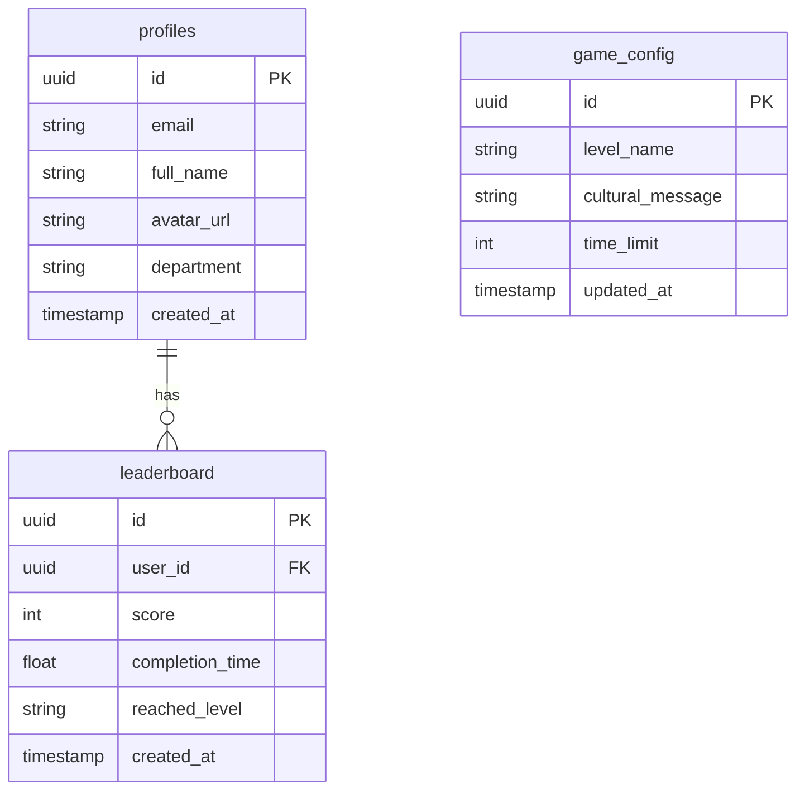

# TÀI LIỆU CHI TIẾT: THÔNG SỐ KỸ THUẬT & HỆ THỐNG (TECHNICAL SPECS)
**Dự án:** VTI 9-Year Adventure - Kaizen Journey | **Đội thi:** Kaizen Delivery Squad

---

Tài liệu này đặc tả kiến trúc mã nguồn, thiết kế cơ sở dữ liệu Supabase, tích hợp Google SSO và cấu trúc component Canvas trên nền tảng Next.js (App Router).

---

## 1. KIẾN TRÚC MÃ NGUỒN NEXT.JS (APP ROUTER)

Dự án sử dụng Next.js làm framework cốt lõi. Giao diện bao quanh (Dashboard, Login, Leaderboard, Admin) được render phía máy chủ (SSR) hoặc máy khách (CSR) tùy nhu cầu, trong khi Game Canvas chạy 100% Client-side.

### Thư mục dự án tiêu chuẩn:
```text
/src
  ├── app/
  │    ├── layout.tsx           # Layout dùng chung cho toàn app (Import Google Fonts)
  │    ├── page.tsx             # Giao diện chính (Dashboard, dẫn đến Chơi game/Xếp hạng)
  │    ├── login/
  │    │    └── page.tsx        # Trang đăng nhập (Tích hợp nút Google SSO)
  │    ├── game/
  │    │    └── page.tsx        # Màn hình chơi game (Chứa component Canvas)
  │    ├── leaderboard/
  │    │    └── page.tsx        # Trang bảng xếp hạng thời gian thực
  │    └── admin/
  │         └── page.tsx        # CMS Quản trị cấu hình game (Chỉ Admin truy cập)
  ├── components/
  │    ├── GameCanvas.tsx       # Component Canvas chứa Game Loop chính ("use client")
  │    ├── Navbar.tsx           # Thanh điều hướng Glassmorphism
  │    └── LeaderboardTable.tsx # Bảng hiển thị xếp hạng
  ├── lib/
  │    ├── supabase.ts          # Client Supabase kết nối Database
  │    └── utils.ts             # Các hàm bổ trợ
  └── styles/
       └── globals.css          # Định nghĩa tokens màu sắc Gradient và Glassmorphism
```

---

## 2. CƠ SỞ DỮ LIỆU SUPABASE SCHEMA

Supabase đóng vai trò làm Backend-as-a-Service (BaaS). Sau đây là thiết kế chi tiết 3 bảng dữ liệu chính:



### A. Bảng `profiles` (Thông tin người chơi)
Bảng này lưu trữ thông tin tự động đồng bộ từ Google SSO của VTI:
```sql
CREATE TABLE profiles (
    id UUID REFERENCES auth.users ON DELETE CASCADE PRIMARY KEY,
    email TEXT UNIQUE NOT NULL,
    full_name TEXT,
    avatar_url TEXT,
    department TEXT NOT NULL, -- Lấy từ email phòng ban hoặc nhập bổ sung
    created_at TIMESTAMP WITH TIME ZONE DEFAULT TIMEZONE('utc'::text, NOW()) NOT NULL
);
```

### B. Bảng `leaderboard` (Bảng xếp hạng thời gian thực)
Lưu kết quả chơi game của VTIans để xếp hạng cá nhân và phòng ban:
```sql
CREATE TABLE leaderboard (
    id UUID DEFAULT gen_random_uuid() PRIMARY KEY,
    user_id UUID REFERENCES profiles(id) ON DELETE CASCADE NOT NULL,
    score INTEGER DEFAULT 0 NOT NULL,
    completion_time REAL NOT NULL, -- Thời gian hoàn thành game (giây)
    reached_level TEXT NOT NULL,   -- Màn chơi hiện tại đạt tới (Hanoi/Danang/Tokyo)
    created_at TIMESTAMP WITH TIME ZONE DEFAULT TIMEZONE('utc'::text, NOW()) NOT NULL
);
```

### C. Bảng `game_config` (CMS Quản trị game)
Lưu trữ thông điệp văn hóa và cấu hình thời gian giới hạn cho mỗi màn chơi:
```sql
CREATE TABLE game_config (
    id UUID DEFAULT gen_random_uuid() PRIMARY KEY,
    level_key TEXT UNIQUE NOT NULL, -- 'hanoi', 'danang', 'tokyo'
    cultural_message TEXT NOT NULL, -- Thông điệp hiển thị khi ăn item
    time_limit INTEGER DEFAULT 120 NOT NULL, -- Giới hạn thời gian chơi (giây)
    updated_at TIMESTAMP WITH TIME ZONE DEFAULT TIMEZONE('utc'::text, NOW()) NOT NULL
);
```

---

## 3. QUY TRÌNH XÁC THỰC GOOGLE SSO (VTI EMAIL ONLY)

Để đảm bảo chỉ các VTIans được tham gia cuộc thi, hệ thống bắt buộc kiểm tra tên miền email đăng nhập:

1.  **Kích hoạt Google Provider trong Supabase:** Cấu hình Client ID và Client Secret từ Google Cloud Console.
2.  **Khởi tạo sự kiện đăng nhập phía Client:**
    ```typescript
    const handleGoogleLogin = async () => {
        const { error } = await supabase.auth.signInWithOAuth({
            provider: 'google',
            options: {
                redirectTo: `${window.location.origin}/auth/callback`,
                queryParams: {
                    hd: 'vti.com.vn' // Chỉ cho phép tài khoản thuộc domain vti.com.vn
                }
            }
        });
    };
    ```
3.  **Middleware / Callback validation:** Tại `/auth/callback`, kiểm tra nếu email trả về không kết thúc bằng `@vti.com.vn`, tự động hủy session và Redirect về trang Login kèm thông báo lỗi *"Vui lòng sử dụng email VTI để đăng nhập"*.

---

## 4. KHUNG COMPONENT CANVAS & DỌN DẸP BỘ NHỚ (MEMORY CLEANUP)

Trong Next.js, việc chạy HTML5 Canvas yêu cầu quản lý chặt chẽ vòng đời của Component trong React để tránh **Memory Leaks** (rò rỉ bộ nhớ) do Game Loop vẫn tiếp tục chạy ẩn sau khi người chơi đã chuyển trang, hoặc tích tụ hàng trăm listener sự kiện bàn phím.

### Cấu trúc Component `GameCanvas.tsx` chuẩn chống rò rỉ:
```typescript
"use client";

import React, { useEffect, useRef } from "react";
import { supabase } from "@/lib/supabase";

export default function GameCanvas() {
    const canvasRef = useRef<HTMLCanvasElement | null>(null);
    const requestRef = useRef<number | null>(null);

    useEffect(() => {
        const canvas = canvasRef.current;
        if (!canvas) return;
        const ctx = canvas.getContext("2d");
        if (!ctx) return;

        // 1. Khởi tạo trạng thái Game
        let isRunning = true;
        const keys = { left: false, right: false, up: false };

        // 2. Định nghĩa các hàm xử lý sự kiện
        const handleKeyDown = (e: KeyboardEvent) => {
            if (e.key === "ArrowLeft" || e.key === "a") keys.left = true;
            if (e.key === "ArrowRight" || e.key === "d") keys.right = true;
            if (e.key === "ArrowUp" || e.key === "w" || e.key === " ") keys.up = true;
        };

        const handleKeyUp = (e: KeyboardEvent) => {
            if (e.key === "ArrowLeft" || e.key === "a") keys.left = false;
            if (e.key === "ArrowRight" || e.key === "d") keys.right = false;
            if (e.key === "ArrowUp" || e.key === "w" || e.key === " ") keys.up = false;
        };

        // Đăng ký Event Listeners
        window.addEventListener("keydown", handleKeyDown);
        window.addEventListener("keyup", handleKeyUp);

        // 3. Vòng lặp Game (Game Loop)
        const gameLoop = () => {
            if (!isRunning) return;

            // Xử lý Logic (Update)
            // ... (Cập nhật vật lý, va chạm, điểm số)

            // Vẽ giao diện (Render / Draw)
            ctx.clearRect(0, 0, canvas.width, canvas.height);
            // ... (Vẽ Background, vẽ Mascot, vẽ kẻ địch)

            // Tiếp tục vòng lặp
            requestRef.current = requestAnimationFrame(gameLoop);
        };

        // Bắt đầu vòng lặp game
        requestRef.current = requestAnimationFrame(gameLoop);

        // 4. CLEANUP FUNCTION (Cực kỳ quan trọng để chống Memory Leaks!)
        return () => {
            isRunning = false;
            if (requestRef.current) {
                cancelAnimationFrame(requestRef.current); // Dừng Game Loop hoàn toàn
            }
            // Hủy đăng ký Event Listeners
            window.removeEventListener("keydown", handleKeyDown);
            window.removeEventListener("keyup", handleKeyUp);
        };
    }, []);

    return (
        <div className="flex justify-center items-center p-4 bg-slate-950 rounded-2xl border border-slate-800 shadow-2xl">
            <canvas 
                ref={canvasRef} 
                width={800} 
                height={450} 
                className="bg-slate-900 rounded-lg shadow-inner border border-slate-700"
            />
        </div>
    );
}
```
