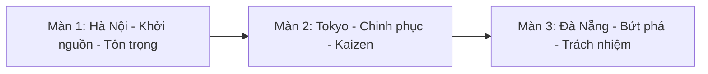
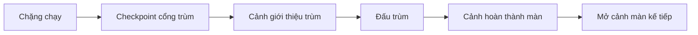

# TÀI LIỆU THIẾT KẾ GAME: VTI 9-YEAR ADVENTURE - KAIZEN JOURNEY

**Phiên bản:** 3.0 | **Dự án:** AI Gameathon 2026 | **Đội thi:** Kaizen Delivery Squad

---

## 1. Mục Đích Tài Liệu

GDD này đặc tả **thiết kế trải nghiệm game**: ý tưởng chủ đạo, nhịp chơi, thế giới, màn chơi, nhân vật, vật phẩm, kẻ địch, trùm, cảnh chuyển, âm thanh và định hướng tài nguyên hình ảnh để sinh bằng Stitch.

Các yêu cầu chức năng, thuật toán gameplay, kiến trúc Next.js, Supabase, lược đồ dữ liệu, xác thực, hệ thống điểm và checklist kỹ thuật được quản lý trong:

> [Tài liệu đặc tả yêu cầu phần mềm](../SRS/SRS.md)

---

## 2. Tổng Quan Game

- **Tên game:** VTI 9-Year Adventure - Kaizen Journey.
- **Thông điệp chủ đạo:** **"VTI 9 Năm - Công nghệ kiến tạo giá trị mới"**.
- **Thể loại:** Game chạy ngang 2D, nhân vật tự chạy theo từng chặng.
- **Nhịp tham chiếu:** Zombie Tsunami, kết hợp checkpoint trùm, Chế độ Kaizen và chủ đề VTI.
- **Ý tưởng chủ đạo:** Mascot VTI chạy qua 3 địa danh gắn với hành trình phát triển: Hà Nội, Tokyo, Đà Nẵng.
- **Giá trị cốt lõi:** Tôn trọng, Trách nhiệm, Kaizen.

---

## 3. Trụ Cột Thiết Kế

### 3.1. Màn Chạy Dễ Đọc

Người chơi luôn chạy về bên phải. Toàn bộ thiết kế hình ảnh phải phục vụ phản xạ nhanh:

- Dáng nhận diện của vật phẩm, kẻ địch và chướng ngại phải rõ ở tốc độ cao.
- Vùng nguy hiểm cần tín hiệu cảnh báo trước khi gây sát thương.
- Nền cảnh có bản sắc địa phương nhưng không tranh độ tương phản với lớp gameplay.
- Tài nguyên gameplay ưu tiên nhận diện tức thì hơn chi tiết trang trí nhỏ.

### 3.2. Văn Hóa Địa Phương + Công Nghệ VTI

Không dùng cyberpunk tối nặng hoặc motif công nghệ chung chung. Mỗi màn cần kết hợp:

- Địa danh và văn hóa địa phương.
- Dấu hiệu văn phòng/hành trình VTI.
- Ngôn ngữ công nghệ sáng, sạch, giàu năng lượng.
- Màu nhấn đủ tách lớp vật phẩm/kẻ địch khỏi nền.

### 3.3. Ba Giá Trị Cốt Lõi Là Motif Gameplay

- **Tôn trọng:** Khiên bảo vệ, màu xanh lục/vàng nhạt, cảm giác vững và tin cậy.
- **Trách nhiệm:** Cánh công nghệ, tạo đoạn bay và né Bom dù, cảm giác chủ động nhận thử thách.
- **Kaizen:** Nội năng tích lũy, bàn phím bắn "Tab"/"Enter", cảm giác bứt phá và cải tiến liên tục.

---

## 4. Cấu Trúc Hành Trình

Mỗi màn có cùng cấu trúc trải nghiệm:

---

## 5. Tóm Tắt Thiết Kế Gameplay

Chi tiết hành vi bắt buộc và thông số triển khai nằm trong SRS. Ở cấp thiết kế, gameplay cần giữ các điểm sau:

- **Chặng chạy:** Dạy và kiểm tra nhảy, cúi, bay, né, giẫm đầu kẻ địch và nhặt bình kinh nghiệm.
- **Đấu trùm:** Tập trung vào né đạn, đọc pattern trùm và bắn trùm bằng Chế độ Kaizen.
- **Bình kinh nghiệm:** Vật phẩm thu thập chính, thường đi theo cụm 3 bình dạng parabol ngược.
- **Bug mặt đất:** Chỉ bị hạ bằng cách giẫm từ trên xuống.
- **Bug bay:** Chỉ bị hạ bằng đạn bàn phím trong Chế độ Kaizen.
- **Hố sâu:** Rủi ro cao nhất, cần tín hiệu cảnh báo rõ và yêu cầu nhảy qua.
- **Bom:** Khi chạy đất thì cúi né Bom thấp; khi bay thì điều chỉnh độ cao để né Bom dù.

---

## 6. Thiết Kế Thế Giới

Tài liệu chi tiết cho từng màn:

> [01_World_Design.md](./01_World_Design.md)

Tóm tắt định hướng:

| Màn | Vai trò | Giá trị | Màu chủ đạo | Trùm |
| --- | --- | --- | --- | --- |
| Hà Nội | Nhập môn màn chạy | Tôn trọng | Vàng hoàng hôn, cam ấm, xanh Hồ Gươm, đỏ VTI | Boss Deadline Cổ Phố |
| Tokyo | Trung cấp, đọc tín hiệu cảnh báo và dùng Kaizen | Kaizen | Hồng sakura, trắng, đỏ mặt trời, xanh công nghệ | Boss Kaizen Breaker |
| Đà Nẵng | Cao trào, kết hợp nhảy/cúi/bay | Trách nhiệm | Xanh đại dương, vàng cát, cam nắng, trắng sáng | Boss Data Storm Dragon |

---

## 7. Kế Hoạch Tài Nguyên Hình Ảnh & Stitch

Tài liệu lập kế hoạch frame và prompt tài nguyên hình ảnh:

> [02_Stitch_Asset_Plan.md](./02_Stitch_Asset_Plan.md)

Quy chuẩn phong cách dùng cho prompt và đánh giá tài nguyên Stitch:

> [../../.skills/item_art_style_stitch.md](../../.skills/item_art_style_stitch.md)

Nhóm tài nguyên cần sinh:

- Mascot theo màn: đứng chờ, chạy, nhảy, cúi, bay, trúng đòn, Kaizen.
- Bình kinh nghiệm theo màn.
- Vật phẩm hỗ trợ: Khiên Tôn trọng, Cánh Trách nhiệm, Bàn phím Kaizen.
- Kẻ địch: Bug mặt đất, Bug bay theo màn.
- Chướng ngại: Hố sâu, Bom thấp, Bom dù.
- Trùm: tranh giới thiệu, sprite gameplay, frame trúng đòn/thất bại.
- Cảnh chuyển: giới thiệu trùm, hoàn thành màn, mở cảnh màn kế tiếp.
- Biểu tượng HUD: máu, điểm, Nội năng Kaizen, bộ đếm thời gian vật phẩm hỗ trợ.

---

## 8. Thiết Kế Cảnh Chuyển & Âm Thanh

### 8.1. Cảnh Chuyển

- **Giới thiệu trùm:** Hiện trùm, tên trùm, câu thoại thử thách và đưa người chơi vào checkpoint trùm.
- **Hoàn thành màn:** Tóm tắt ý nghĩa hành trình màn, điểm số và thông điệp văn hóa.
- **Mở cảnh màn kế tiếp:** Chuyển sang địa phương tiếp theo, giữ cảm giác hành trình liên tục.

### 8.2. Âm Thanh

- Mỗi màn có nhạc nền chặng chạy và nhạc nền đấu trùm riêng.
- Hiệu ứng âm thanh cần rõ cho: nhặt bình, khiên, cánh, Kaizen sẵn sàng, bắn "Tab"/"Enter", Bug chết, mất máu, giới thiệu trùm, trùm trúng đòn, trùm bị hạ, rơi Hố sâu.
- Âm thanh phải hỗ trợ khả năng đọc tình huống: cảnh báo nguy hiểm, trạng thái vật phẩm hỗ trợ và chuyển giai đoạn.

---

## 9. Phụ Lục Thuật Ngữ

| Thuật ngữ dùng trong tài liệu | Tên tiếng Anh / tên kỹ thuật | Diễn giải |
| --- | --- | --- |
| GDD | Game Design Document | Tài liệu thiết kế trải nghiệm game, thế giới, màn chơi, mỹ thuật, âm thanh và cảnh chuyển. |
| SRS | Software Requirements Specification | Tài liệu đặc tả yêu cầu phần mềm, luật gameplay, kỹ thuật, dữ liệu và kiểm thử. |
| Màn | Map | Một địa phương trong hành trình game: Hà Nội, Tokyo hoặc Đà Nẵng. |
| Chặng chạy | Runner phase | Đoạn nhân vật tự chạy, người chơi nhảy/cúi/bay/né/thu thập. |
| Đấu trùm | Boss phase | Đoạn đối đầu trùm cuối màn, tập trung né đạn và phản công. |
| Checkpoint trùm | Boss checkpoint | Mốc lưu tiến trình tại cổng trùm. |
| Cảnh chuyển | Cutscene | Đoạn trình bày ngắn dùng cho giới thiệu trùm, hoàn thành màn hoặc chuyển sang màn kế tiếp. |
| Mascot | Mascot | Nhân vật đại diện VTI do người chơi điều khiển. |
| Bug | Bug | Kẻ địch đại diện cho lỗi, trở ngại hoặc vấn đề trong hành trình công việc. |
| Bình kinh nghiệm | Experience Flask | Vật phẩm thu thập chính, dùng để tăng điểm và Nội năng Kaizen. |
| Nội năng Kaizen | Kaizen Energy | Thanh năng lượng tích lũy để kích hoạt Chế độ Kaizen. |
| Chế độ Kaizen | Kaizen Mode | Trạng thái bứt phá: tăng tốc, nhảy cao hơn và bắn được đạn bàn phím. |
| Vật phẩm hỗ trợ | Power-up | Vật phẩm tạo hiệu ứng đặc biệt trong thời gian ngắn. |
| Khiên Tôn trọng | Respect Shield | Vật phẩm hỗ trợ bảo vệ khỏi đạn, Bug và Bom trong thời gian ngắn. |
| Cánh Trách nhiệm | Responsibility Wings | Vật phẩm hỗ trợ cho phép nhân vật bay lên/hạ độ cao trong thời gian ngắn. |
| Bàn phím Kaizen | Kaizen Keyboard | Vũ khí trong Chế độ Kaizen, bắn đạn chữ "Tab" và "Enter". |
| Tín hiệu cảnh báo | Telegraph | Dấu hiệu hình ảnh/âm thanh báo trước nguy hiểm. |
| Pattern | Pattern | Mẫu hành vi lặp lại của chướng ngại, đạn hoặc trùm để người chơi học và phản xạ. |
| Giẫm đầu | Stomp | Hành động nhảy từ trên xuống để hạ Bug mặt đất. |
| Sprite | Sprite | Ảnh hoặc frame 2D dùng để vẽ nhân vật, vật phẩm, kẻ địch, trùm trong Canvas. |
| Sprite sheet | Sprite sheet | Một ảnh chứa nhiều frame animation của cùng một đối tượng. |
| HUD | Heads-up Display | Lớp giao diện hiển thị máu, điểm, Nội năng Kaizen và thời gian power-up. |
| Stitch | Stitch | Công cụ AI dùng để tạo frame/tài nguyên hình ảnh theo prompt. |
| Prompt | Prompt | Mô tả đầu vào gửi cho Stitch để sinh ảnh. |

---

## 10. Tài Liệu Liên Quan

- [SRS](../SRS/SRS.md): yêu cầu phần mềm, luật gameplay, kỹ thuật, Supabase, xác thực và kiểm thử.
- [Thiết kế thế giới](./01_World_Design.md): thiết kế chi tiết Hà Nội, Tokyo, Đà Nẵng.
- [Kế hoạch tài nguyên Stitch](./02_Stitch_Asset_Plan.md): danh sách tài nguyên/frame và hướng dẫn prompt.
- [Skill phong cách mỹ thuật](../../.skills/item_art_style_stitch.md): quy chuẩn sinh và đánh giá tài nguyên bằng Stitch.
