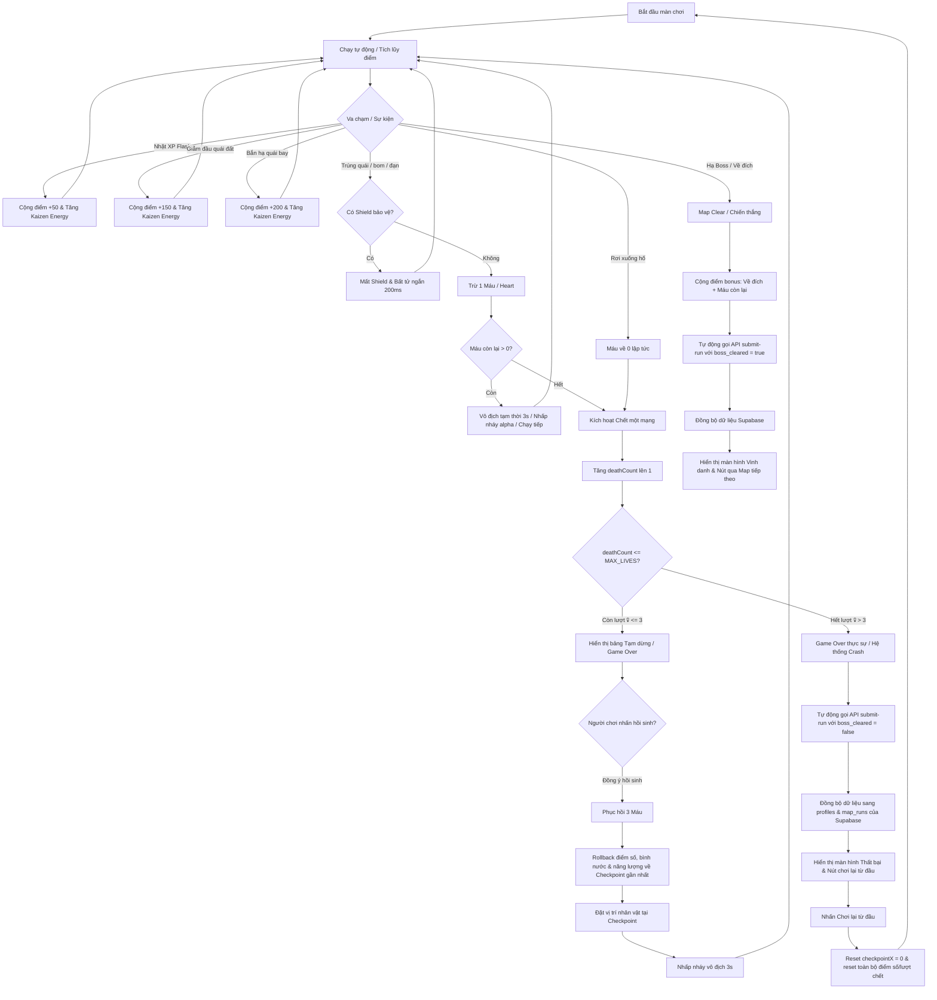

# Kế hoạch chi tiết (Implementation Plan): Xử lý Core Gameplay & Hồi sinh nhân vật

Tài liệu này chi tiết hóa kế hoạch triển khai các cơ chế gameplay cốt lõi của nhân vật (Player/Mascot) trong một màn chơi của game **VTI Kaizen Journey**, bao gồm xử lý va chạm, mất máu, rơi hố, cơ chế hồi sinh tại checkpoint, giới hạn lượt chơi, tính điểm và đồng bộ kết quả lên Supabase Database.

---

## 1. Luồng hoạt động Gameplay (Game Loop & Lifecycle)

Dưới đây là sơ đồ Mermaid mô tả luồng xử lý từ khi người chơi bắt đầu chạy, va chạm chướng ngại vật/rơi hố, hồi sinh cho đến khi kết thúc và lưu điểm vào Supabase DB:



---

## 2. Các cơ chế Gameplay chi tiết

### A. Cơ chế Va chạm & Trừ máu (Collision & Damage)
1. **Va chạm quái/chướng ngại vật:**
   - **Phát hiện va chạm:** Sử dụng hộp va chạm AABB (co nhỏ hitbox thực tế 4-6px ở các góc để tối ưu trải nghiệm người chơi).
   - **Xử lý bất tử:** Nếu `state.invulnerableUntil > time.now` hoặc `state.shieldUntil > time.now`, người chơi được miễn nhiễm sát thương.
   - **Trừ máu:** Khi bị đánh trúng và không có khiên:
     - `state.hearts = Math.max(0, state.hearts - 1)`.
     - Nếu `state.hearts > 0`: Kích hoạt trạng thái bất tử tạm thời trong 3 giây (`state.invulnerableUntil = time.now + 3000`), nhân vật nhấp nháy alpha (0.2 - 1.0) và tiếp tục chạy.
     - Nếu `state.hearts == 0`: Gọi hàm kích hoạt Game Over chặng (`triggerGameOver()`).
2. **Rơi xuống hố sâu (Pit Fall):**
   - **Phát hiện:** Nhân vật đi ra ngoài biên dưới của màn hình (`sprite.y > 540`).
   - **Trừ máu:** Rơi xuống hố là chết ngay lập tức, bỏ qua số máu hiện tại.
     - `state.hearts = 0`.
     - Gọi `triggerGameOver()`.

---

### B. Cơ chế Chết & Hồi sinh tại Checkpoint (Death & Respawn Loop)
1. **Lượt hồi sinh tối đa (`MAX_LIVES = 3`):**
   - Người chơi có tối đa **3 lượt hồi sinh** từ Checkpoint trong một màn chơi (tương đương tối đa `deathCount = 3`).
   - Mỗi lần chết (`hearts == 0`), `state.deathCount` tăng thêm 1.
2. **Checkpoint chặng:**
   - **Mốc lưu:** Tự động lưu checkpoint khi đi qua các mốc tọa độ X (`x = 2000`, `x = 4000`) và tại cổng Boss (`boss_intro`).
   - **Dữ liệu lưu tại Checkpoint:**
     - Tọa độ checkpoint: `checkpointX` (hoặc `bossTriggerX`).
     - Điểm số tại mốc đó: `checkpointScore`.
     - Năng lượng Kaizen tại mốc đó: `checkpointEnergy`.
     - Số bình nước nhặt được tại mốc đó: `checkpointFlasks`.
3. **Luồng Hồi sinh (Respawn):**
   - **Trường hợp `deathCount <= 3` (Còn lượt):**
     - HUD hiển thị bảng thông báo lỗi hệ thống tạm thời ("BẢN GHI LỖI"), kèm số lượt hồi sinh còn lại (`3 - deathCount`).
     - Khi nhấn nút **HỒI SINH TẠI CHECKPOINT**, game sẽ:
       - Đặt lại máu `state.hearts = 3`.
       - Rollback các thông số: `score = checkpointScore`, `kaizenEnergy = checkpointEnergy`, `flasksCollected = checkpointFlasks`.
       - Xóa toàn bộ quái vật, chướng ngại vật, đạn trên màn hình để làm sạch đường đua.
       - Tái tạo mặt đất vững chãi xung quanh checkpoint để tránh player bị rơi tiếp.
       - Đưa nhân vật về tọa độ checkpoint và kích hoạt hiệu ứng nhấp nháy bất tử 3 giây.
   - **Trường hợp `deathCount > 3` (Hết lượt):**
     - HUD hiển thị bảng thông báo lỗi nghiêm trọng ("HỆ THỐNG CRASH"), nút hồi sinh tại checkpoint bị ẩn/vô hiệu hóa, chỉ có nút **BẮT ĐẦU LẠI TỪ ĐẦU**.
     - Tự động kích hoạt luồng **Lưu điểm Thất bại** (submit score của lượt chơi hiện tại về DB với `boss_cleared = false`).
     - Khi nhấn nút **BẮT ĐẦU LẠI TỪ ĐẦU**:
       - Reset hoàn toàn trạng thái màn chơi về vạch xuất phát: `checkpointX = 0`, `checkpointScore = 0`, `checkpointEnergy = 0`, `checkpointFlasks = 0`.
       - Reset điểm chạy hiện tại về 0, máu về 3, lượt chết `deathCount` về 0.
       - Đưa nhân vật về điểm bắt đầu (`x = -50` để thực hiện sequence chạy vào).

---

### C. Cơ chế Tính điểm (Scoring)
*   **Bình kinh nghiệm (XP Flask):** `+50` điểm mỗi bình.
*   **Tiêu diệt Bug mặt đất (Stomp - nhảy lên đầu):** `+150` điểm.
*   **Tiêu diệt Bug bay (Bắn đạn phím trong Kaizen Mode):** `+200` điểm.
*   **Tiêu diệt Boss chặng:** `+2000` điểm.
*   **Hoàn thành màn chơi (Map Clear):** `+1000` điểm.
*   **Thưởng máu còn lại khi về đích:** `+300` điểm cho mỗi trái tim (tối đa `+900` điểm).

---

### D. Đồng bộ & Lưu điểm vào Database (Supabase Integration)
Mỗi khi kết thúc lượt chạy (dù là thắng cuộc hay thất bại hết mạng dọc đường), game đều phải tự động lưu điểm của lượt chạy đó vào bảng `map_runs` trên Supabase:
1. **Lưu khi thắng (Map Clear):**
   - Kích hoạt khi Boss bị tiêu diệt và nhân vật chạy qua điểm đích.
   - Gọi API `POST /api/game/submit-run` với body:
     ```json
     {
       "mapKey": "hanoi",
       "score": 4500, // Điểm đã cộng bonus clear map + bonus hearts
       "completionTime": 72.5,
       "bossCleared": true
     }
     ```
2. **Lưu khi thua (Hết mạng - Game Over thực sự):**
   - Kích hoạt khi người chơi chết lần thứ 4 (hết lượt hồi sinh).
   - Gọi API `POST /api/game/submit-run` với body:
     ```json
     {
       "mapKey": "hanoi",
       "score": 1850, // Điểm số tại checkpoint gần nhất trước khi chết
       "completionTime": 45.2,
       "bossCleared": false
     }
     ```
3. **Database Trigger:**
   - Supabase DB có trigger `trigger_on_map_run_insert` lắng nghe sự kiện insert vào bảng `map_runs`.
   - Trigger này sẽ tự động kiểm tra xem điểm số của map này có lớn hơn điểm kỷ lục cũ của user trong bảng `journey_scores` không. Nếu lớn hơn, nó sẽ cập nhật cột tương ứng (`hanoi_best_score`, `tokyo_best_score`, `danang_best_score`) và tự động cộng tổng để cập nhật cột `total_score` (tổng điểm hành trình).

---

## 3. Kế hoạch triển khai & Thay đổi Code (Proposed Changes)

Để thực thi plan này, chúng ta cần chỉnh sửa các thành phần sau trong codebase:

### 1. Game State (`src/game/engine/GameState.ts`)
*   Đảm bảo `deathCount` được đồng bộ chuẩn xác.
*   Thêm biến cấu hình `MAX_LIVES = 3` nếu cần hoặc dùng hằng số trực tiếp.

### 2. Player System (`src/game/entities/PlayerSystem.ts`)
*   [MODIFY] Cập nhật hàm `handlePitFall()`: Không gọi `triggerGameOver()` lập tức nếu còn lượt hồi sinh nhanh tại checkpoint?
    > [!IMPORTANT]
    > Theo thiết kế, **rơi xuống hố** được tính là một lần chết (chết một mạng). Do đó, khi rơi hố, ta sẽ trừ toàn bộ máu (`hearts = 0`), tăng `deathCount` và gọi `triggerGameOver()`. Giao diện Game Over sẽ quyết định xem player được hồi sinh tại checkpoint (nếu còn lượt) hay phải về điểm xuất phát.
*   [MODIFY] Cập nhật hàm `takeDamage()`:
    - Khi trúng đạn/quái, trừ 1 máu.
    - Nếu máu về 0 -> tăng `deathCount` và gọi `triggerGameOver()`.
    - Nếu máu > 0 -> kích hoạt bất tử nhấp nháy 3s và hồi sinh nhanh tại chỗ (`triggerDamageRespawn`).

### 3. Game Scene Coordinator (`src/game/scenes/GameScene.ts`)
*   [MODIFY] Cập nhật hàm `respawn()` để xử lý 2 trường hợp:
    - **Hồi sinh chặng (Restart chặng):** Khi còn lượt hồi sinh, người chơi hồi sinh tại checkpoint gần nhất (`checkpointX`). Rollback điểm số, năng lượng và số flask nhặt được về giá trị checkpoint. Máu hồi phục về 3.
    - **Chơi lại từ đầu (Restart from beginning):** Khi hết lượt hồi sinh, reset toàn bộ checkpoint về 0, reset điểm chạy, máu về 3, lượt chết về 0, đưa nhân vật về điểm khởi đầu `x = -50`.
*   [MODIFY] Kiểm tra cơ chế dọn dẹp quái, chướng ngại vật và tái tạo địa hình xung quanh checkpoint khi gọi `respawn()` để đảm bảo player không bị kẹt hoặc rơi hố tiếp ngay sau khi hồi sinh.

### 4. Game Dashboard Client Component (`src/app/game/GameDashboard.tsx`)
*   [MODIFY] Cập nhật state quản lý UI Game Over.
*   [MODIFY] Thêm **Cơ chế Tự động lưu điểm khi Game Over thực sự (Hết lượt):**
    - Khi game over và `hudState.deathCount >= 3` (hoặc lúc game over lần cuối), component sẽ gửi request đến `/api/game/submit-run` với `bossCleared = false` và số điểm tích lũy được tại checkpoint trước khi chết.
*   [MODIFY] Đảm bảo nút **BẮT ĐẦU LẠI TỪ ĐẦU** gọi đúng hàm `handleRestartFromBeginning` để reset sạch sẽ state.

### 5. Cutscene Overlay Component (`src/components/game/CutsceneOverlay.tsx`)
*   [MODIFY] Cập nhật logic hiển thị màn hình Game Over:
    - Nếu `deathCount < 3` (còn lượt): Hiển thị nút **🔄 HỒI SINH TẠI CHECKPOINT (Còn lại N lượt)**. Nút này kích hoạt `onRestartGame()`.
    - Nếu `deathCount >= 3` (hết lượt): Ẩn nút hồi sinh checkpoint, chỉ hiển thị nút **⚠️ BẮT ĐẦU LẠI TỪ ĐẦU** và thông báo lỗi nghiêm trọng hệ thống crash. Nút này kích hoạt `onRestartFromBeginning()`.
    - Hiển thị spinner và trạng thái tự động lưu điểm lên bảng xếp hạng kể cả khi thua hết mạng.

---

## 4. Kịch bản kiểm thử & Xác minh (Verification Plan)

### A. Kiểm thử Gameplay thủ công (Manual Verification)
1. **Va chạm & Mất máu:**
   - Cho nhân vật va chạm với quái đất hoặc đạn boss khi đang chạy.
   - Xác minh máu bị trừ 1 tim, nhân vật nhấp nháy mờ alpha và không bị mất máu tiếp trong 3 giây tiếp theo.
2. **Rơi xuống hố:**
   - Để nhân vật rơi xuống hố sâu.
   - Xác minh máu lập tức bị trừ về 0, màn hình game dừng lại và hiển thị bảng Game Over.
3. **Lượt hồi sinh tại Checkpoint:**
   - Đảm bảo vượt qua mốc X = 2000 (đã hiển thị thông báo "LƯU CHECKPOINT!").
   - Cho nhân vật chết lần 1 (bởi quái hoặc rơi hố).
   - Kiểm tra bảng Game Over hiển thị: "Bạn còn 2 lượt hồi sinh tại Checkpoint".
   - Nhấn **HỒI SINH TẠI CHECKPOINT**. Xác minh nhân vật xuất hiện lại tại vị trí checkpoint X = 2000 với đầy 3 tim, điểm số quay về thời điểm lưu checkpoint, và quái vật xung quanh được dọn dẹp sạch sẽ.
4. **Hết lượt & Quay lại điểm xuất phát:**
   - Tiếp tục cho nhân vật chết lần 2 và lần 3.
   - Chết lần thứ 4 (khi đã hết sạch 3 lượt hồi sinh).
   - Xác minh bảng Game Over hiển thị: "HỆ THỐNG CRASH" và nút hồi sinh bị vô hiệu hóa, chỉ có nút **BẮT ĐẦU LẠI TỪ ĐẦU**.
   - Nhấn **BẮT ĐẦU LẠI TỪ ĐẦU**. Xác minh game đưa nhân vật về vị trí khởi đầu của map (x = 0), điểm số và số mạng chết reset về 0.

### B. Kiểm thử tích hợp Database (Supabase Verification)
1. **Kiểm tra lưu điểm thắng cuộc:**
   - Vượt qua Boss và clear màn chơi.
   - Kiểm tra console / network tab xem có request `POST /api/game/submit-run` gửi lên với `bossCleared = true` và điểm số chính xác.
   - Truy cập database Supabase (hoặc bảng xếp hạng), xác minh bản ghi mới được thêm vào bảng `map_runs` và bảng `journey_scores` được cập nhật tổng điểm cao nhất.
2. **Kiểm tra lưu điểm thua cuộc:**
   - Cho nhân vật chết hết lượt chặng (chết lần thứ 4).
   - Xác minh có request `POST /api/game/submit-run` được gửi đi với `bossCleared = false` và điểm số checkpoint của run đó.
   - Xác minh bảng `map_runs` ghi nhận dòng thông tin thất bại này với điểm số và thời gian chạy tương ứng.
