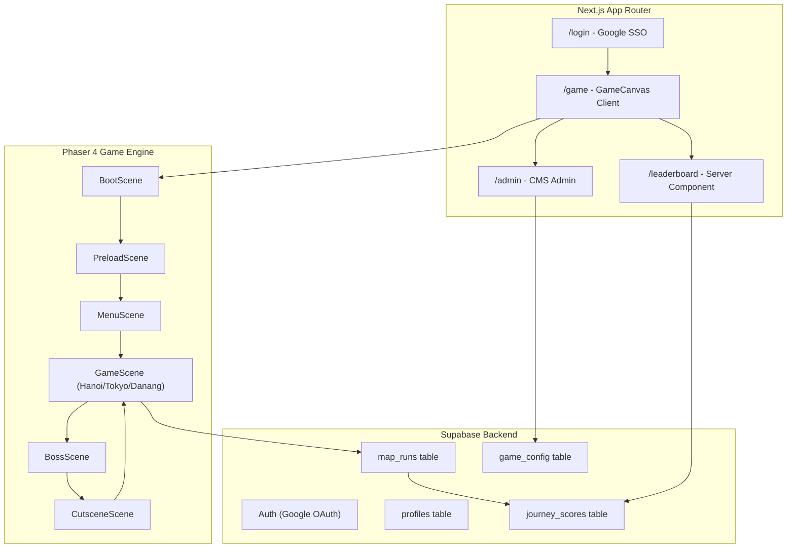

# Implementation Plan: VTI Kaizen Journey 🎮

**Dự án:** VTI 9-Year Adventure – Kaizen Journey  
**Stack:** Next.js 16 · Supabase · TypeScript · Phaser 4 · Stitch MCP  
**Deadline:** 17/06/2026 | **Giai đoạn Code+Test:** 01/06 – 12/06/2026

---

## Tổng quan

Game 2D endless runner theo chặng, 3 map (Hà Nội → Tokyo → Đà Nẵng), xác thực Google SSO chỉ cho email `@vti.com.vn`. Nhân vật luôn chạy phải, người chơi điều khiển nhảy/cúi/bay/bắn. Leaderboard realtime qua Supabase. Admin CMS cấu hình map, scoring, audio.

---

## User Review Required

> [!IMPORTANT]
> **Phaser 4 vs Canvas API thuần:** GDD hiện tại có code mẫu dùng Canvas API thuần (`GameCanvas.tsx`), nhưng `package.json` đã cài `phaser@^4.1.0`. Kế hoạch này dùng **Phaser 4** làm engine game chính (thay thế Canvas API), mount vào Next.js `"use client"` component. Cần confirm.

> [!IMPORTANT]
> **PhysicsEditor 2D:** Tool này sinh file `.json` / `.xml` định nghĩa polygon hitbox cho sprite. Kế hoạch sẽ tích hợp output của PhysicsEditor vào Phaser Matter.js hoặc Arcade Physics. Nếu chưa có PhysicsEditor, có thể dùng Phaser Arcade Physics với hitbox hình chữ nhật trước, nâng cấp sau.

> [!WARNING]
> **Credentials Supabase & Google OAuth:** Cần điền `NEXT_PUBLIC_SUPABASE_URL`, `NEXT_PUBLIC_SUPABASE_ANON_KEY`, và cấu hình Google OAuth trong Supabase Dashboard trước khi test auth.

> [!NOTE]
> **Audio assets:** Nhạc nền và SFX theo GDD cần được tạo/mua. Trong giai đoạn dev, dùng placeholder audio (Web Audio API oscillator). Stitch không sinh audio, cần nguồn riêng.

---

## Open Questions

1. **Stitch design system:** Dùng Stitch để gen hình ảnh nhân vật, enemy, boss, items cho cả 3 map. Mỗi map cần khoảng 10-15 assets. Nên gen theo từng map hay gen tất cả một lần?
2. **Phaser scene structure:** Dùng Scene riêng cho mỗi map hay dùng 1 Scene với config thay đổi? → Đề xuất: 1 `GameScene` tái sử dụng + data config theo map.
3. **Realtime leaderboard:** Dùng Supabase Realtime channel hay polling mỗi 30 giây?
4. **Admin auth:** Admin page dùng email whitelist hay Supabase role? GDD ghi `check email admin`.
5. **Phần trăm hoàn thành mong muốn cho demo ngày 12/06?** Cần ít nhất Map 1 hoàn chỉnh + Leaderboard?

---

## Kiến trúc tổng thể



---

## Proposed Changes

### Phase 0 — Stitch Design Generation (Ưu tiên đầu tiên)

**Mục tiêu:** Sinh toàn bộ visual assets trước khi code engine để có đủ sprite, sheet.

#### Assets cần gen qua Stitch MCP

**Mascot (3 skins):**
| Skin | Map | Mô tả |
|------|-----|--------|
| `mascot_hanoi` | Hà Nội | Áo dài cách tân đỏ/vàng, giày thể thao, tai nghe |
| `mascot_tokyo` | Tokyo | Kimono cách tân hoặc business casual high-tech |
| `mascot_danang` | Đà Nẵng | Áo polo xanh VTI, quần thể thao, smart visor |

**Animation frames cần thiết cho mỗi Mascot:** run (8f), jump (6f), crouch (4f), fly (6f), kaizen_mode (8f), damage (4f), death (6f)

**Items & Power-ups (3 variants theo map):**
- Experience Flask × 3 (Hồ Gươm / Anh đào / Biển)
- Respect Shield × 3 (Sen / Hoa/Mặt trời / Phao cứu hộ)
- Responsibility Wings × 3 (Tre/lam / Origami / Phản lực)
- Kaizen Keyboard × 3 (Đỏ/vàng / Tối giản Nhật / Chống nước)
- Projectile "Tab"/"Enter" × 3 styles

**Enemies (2 per map + 1 Boss):**

| Map | Ground Bug | Flying Bug | Boss |
|-----|-----------|-----------|------|
| Hà Nội | Bug Tắc Đường | Bug Trì Hoãn | Boss Deadline Cổ Phố (cỗ máy đồng hồ) |
| Tokyo | Overtime Bug | Language Barrier Bug | Boss Kaizen Breaker |
| Đà Nẵng | Low Battery Bug | Data Leak Bug | Boss Data Storm Dragon |

**Obstacles:** Pit (3 map variants), Bomb ground/air (3 map variants)

**Backgrounds (parallax 3 layers × 3 maps):**
- Hà Nội: Tháp Rùa / Phố cổ / Nền gạch xám
- Tokyo: Núi Phú Sĩ / Shibuya / Vạch đường
- Đà Nẵng: Cầu Rồng / Bãi biển Mỹ Khê / Sàn gỗ

**UI Assets:** HUD frame, hearts, kaizen bar, score display, boss HP bar, cutscene frames, main menu bg

**Stitch prompt strategy:**
1. Tạo Design System chung: "Vocal Cultural & Local Tech Integration" style
2. Gen Mascot base + animation frames
3. Gen items theo từng map (batch)
4. Gen enemies + bosses theo từng map
5. Gen backgrounds (parallax layers)
6. Gen UI elements

---

### Phase 1 — Foundation Setup

#### [MODIFY] [package.json](file:///c:/Users/hungt/Downloads/kaizen-journey-docs-update-core-gameplay/package.json)
Thêm dependencies thiếu: `@supabase/ssr`, `drizzle-orm`, `postgres`, `drizzle-kit`

#### [NEW] `.env.local`
```
NEXT_PUBLIC_SUPABASE_URL=
NEXT_PUBLIC_SUPABASE_ANON_KEY=
SUPABASE_SERVICE_ROLE_KEY=
DATABASE_URL=
```

#### [NEW] `src/lib/supabase/client.ts`
Browser Supabase client (theo supabase-nextjs skill)

#### [NEW] `src/lib/supabase/server.ts`
Server Supabase client (theo supabase-nextjs skill)

#### [NEW] `src/lib/supabase/middleware.ts`
Session management helper

#### [NEW] `src/middleware.ts`
Auth middleware — bảo vệ `/game`, `/leaderboard`, `/admin`. Redirect `/` → `/login` nếu chưa auth.

#### [NEW] `src/db/schema.ts`
Drizzle schema maps tới Supabase tables: `profiles`, `map_runs`, `journey_scores`, `game_config`

#### [NEW] `drizzle.config.ts`
Drizzle Kit config

#### [MODIFY] `src/app/globals.css`
Reset CSS + design tokens (fonts: Inter từ Google Fonts, color palette theo từng map)

#### [MODIFY] `src/app/layout.tsx`
Root layout với metadata SEO chuẩn, font import

---

### Phase 2 — Auth & Login

#### [NEW] `src/app/login/page.tsx`
Landing + Login page với Google SSO button

#### [NEW] `src/components/auth/GoogleLoginButton.tsx`
Button kích hoạt `supabase.auth.signInWithOAuth({ provider: 'google', options: { hd: 'vti.com.vn' } })`

#### [NEW] `src/app/auth/callback/route.ts`
OAuth callback handler — kiểm tra email domain `@vti.com.vn`, tạo profile nếu lần đầu, redirect `/game`

#### [NEW] `src/lib/auth.ts`
Helper: `getUser()`, `requireAuth()`, `requireVtiEmail()`

---

### Phase 3 — Phaser 4 Game Engine

#### Cấu trúc Phaser Scenes

```
src/game/
├── PhaserGame.tsx          ← Client Component mount Phaser
├── config.ts               ← Phaser.Game config (960×540, Arcade Physics)
├── scenes/
│   ├── BootScene.ts        ← Khởi động, load fonts/audio
│   ├── PreloadScene.ts     ← Load tất cả assets với progress bar
│   ├── MenuScene.ts        ← Main menu (Play, Leaderboard, Quit)
│   ├── GameScene.ts        ← Core endless runner (reuse cho 3 maps)
│   ├── BossScene.ts        ← Boss phase (extend GameScene hoặc overlay)
│   ├── CutsceneScene.ts    ← Cutscene overlay
│   └── GameOverScene.ts    ← Game over / Map clear result
├── entities/
│   ├── Player.ts           ← Phaser.Physics.Arcade.Sprite
│   ├── GroundBug.ts
│   ├── FlyingBug.ts
│   ├── Boss.ts
│   ├── Projectile.ts       ← Player "Tab"/"Enter" bullets + Boss bullets
│   ├── ExperienceFlask.ts
│   ├── PowerUp.ts          ← Respect / Responsibility
│   └── Obstacle.ts         ← Pit / Bomb
├── systems/
│   ├── InputManager.ts     ← ArrowUp/W, ArrowDown/S, Space
│   ├── KaizenSystem.ts     ← Energy accumulation + Mode activation
│   ├── ScrollSystem.ts     ← World scroll, parallax layers
│   ├── CheckpointSystem.ts ← Checkpoint save/restore
│   ├── ScoringSystem.ts    ← Real-time score calculation
│   └── AudioManager.ts     ← BGM crossfade, SFX pool
├── maps/
│   ├── MapConfig.ts        ← Type definitions
│   ├── hanoi.ts            ← Map data: speed, obstacles layout, spawn patterns
│   ├── tokyo.ts
│   └── danang.ts
└── constants.ts            ← RUNNER_PHYSICS, SCORE_RULES
```

#### [NEW] `src/game/PhaserGame.tsx`
`"use client"` — tạo `Phaser.Game` trong `useEffect`, cleanup on unmount. Mount tại `/game/page.tsx`.

#### [NEW] `src/game/config.ts`
```typescript
const config: Phaser.Types.Core.GameConfig = {
  type: Phaser.AUTO,
  width: 960,
  height: 540,
  physics: { default: 'arcade', arcade: { gravity: { y: 550 }, debug: false } },
  scene: [BootScene, PreloadScene, MenuScene, GameScene, BossScene, CutsceneScene, GameOverScene]
}
```

#### [NEW] `src/game/entities/Player.ts`
- Phaser.Physics.Arcade.Sprite
- States: running, jumping, crouching, flying, kaizenMode
- Physics constants từ `RUNNER_PHYSICS`
- Animation keys: `run`, `jump`, `crouch`, `fly`, `kaizen`

#### [NEW] `src/game/systems/ScrollSystem.ts`
- Tile sprite backgrounds (parallax: far = 0.2, mid = 0.5, fore = 1.0)
- Object pooling cho obstacles, enemies, collectibles
- Spawn queue từ MapConfig

#### [NEW] `src/game/systems/KaizenSystem.ts`
- Energy tích lũy: `+5%/s`, `+10%/flask`, `+10%/bug`
- Kích hoạt Kaizen Mode 8s khi đầy 100%
- Events: `kaizen-ready`, `kaizen-activated`, `kaizen-expired`

#### [NEW] `src/game/systems/AudioManager.ts`
- Preload BGM per map + boss variant
- Crossfade runner → boss BGM
- SFX pool với cooldown
- Cleanup khi scene destroy

#### [NEW] `src/game/maps/MapConfig.ts`
```typescript
interface MapConfig {
  key: MapKey;
  baseSpeed: number;
  spriteSkin: string;
  bgLayers: { key: string; scrollFactor: number }[];
  spawnPatterns: SpawnPattern[];
  bossConfig: BossConfig;
  audioConfig: AudioConfig;
  cutsceneConfig: CutsceneConfig;
}
```

---

### Phase 4 — UI Screens & Components

#### [NEW] `src/app/game/page.tsx`
Client page bọc `PhaserGame` component, check auth, load game config từ Supabase

#### [NEW] `src/components/game/HUD.tsx`
Overlay React (z-index cao hơn canvas): Hearts × 3, Kaizen Energy bar, Score, Map name  
_Nhận state từ Phaser qua EventEmitter_

#### [NEW] `src/components/game/CutsceneOverlay.tsx`
Fullscreen overlay với boss image, story text, map clear summary. Triggered by Phaser events.

#### [NEW] `src/app/leaderboard/page.tsx`
Server Component — query `journey_scores JOIN profiles`, hiển thị:
- Tab: Tổng hành trình / Hà Nội / Tokyo / Đà Nẵng
- Filter: Cá nhân / Phòng ban
- Realtime với Supabase channel

#### [NEW] `src/components/leaderboard/LeaderboardTable.tsx`
Table với rank, avatar, name, department, score, boss_cleared badge

#### [NEW] `src/app/admin/page.tsx`
Admin CMS — chỉ cho email admin, form cập nhật `game_config` JSONB fields

#### [NEW] `src/components/admin/MapConfigEditor.tsx`
Form fields: scoring_rules, difficulty_config, audio_config, cutscene_config, cultural_message

---

### Phase 5 — Supabase Integration (Game → DB)

#### [NEW] `src/lib/game/scoring.ts`
`calculateMapScore()`, `saveMapRun()` (gọi Supabase insert `map_runs`)

#### [NEW] `src/app/api/game/submit-run/route.ts`
POST endpoint nhận GameState khi map clear, validate, insert `map_runs`  
Trigger Supabase tự động cập nhật `journey_scores`

#### [NEW] `src/lib/game/gameConfig.ts`
Fetch `game_config` từ Supabase, merge với local constants, cache 5 phút

---

### Phase 6 — Audio & Asset Pipeline

#### Audio placeholder strategy
Trong dev phase, dùng Web Audio API oscillator tạo placeholder SFX:
- flask pick: 880Hz, 0.1s
- damage: 220Hz, 0.2s
- kaizen ready: ascending chord

**Cấu trúc asset folders:**
```
public/
├── assets/
│   ├── sprites/
│   │   ├── mascot/           ← output từ Stitch
│   │   ├── enemies/
│   │   ├── items/
│   │   ├── bosses/
│   │   └── ui/
│   ├── backgrounds/
│   │   ├── hanoi/
│   │   ├── tokyo/
│   │   └── danang/
│   └── audio/
│       ├── bgm/              ← placeholder → thay bằng real audio
│       └── sfx/
└── physics/
    └── *.json               ← PhysicsEditor output (hitbox polygons)
```

#### PhysicsEditor Integration
- Export từ PhysicsEditor → `public/physics/<entity>.json`
- Load trong PreloadScene: `this.load.json('physics', '/physics/entities.json')`
- Apply trong entity constructor: dùng Phaser Matter.js `setBody()` với shape data

---

### Phase 7 — Testing & Deploy

#### Testing Checklist (từ GDD 03_Technical_Specs.md Section 10)
- [ ] Auto-run đúng tốc độ từng map
- [ ] ArrowUp/W nhảy, ArrowDown/S cúi, Space bắn (Kaizen Mode)
- [ ] Cụm 3 bình parabol nhặt đủ bằng 1 nhảy
- [ ] Respect Shield chặn damage nhưng không chặn Pit
- [ ] Responsibility Wings 10s, Bom dù hitbox
- [ ] Kaizen Energy tăng 5%/s, 10%/flask, 10%/bug
- [ ] Bug mặt đất chỉ chết khi stomp; Bug bay chỉ chết bởi đạn
- [ ] Boss checkpoint, respawn, boss HP reset
- [ ] Score công thức khớp, journey leaderboard đúng
- [ ] Audio crossfade runner→boss, cleanup khi rời trang
- [ ] Google SSO chỉ accept @vti.com.vn

#### Playwright test script (develop-web-game skill)
```bash
node "$WEB_GAME_CLIENT" --url http://localhost:3000/game \
  --actions-json '{"steps":[{"buttons":["ArrowUp"],"frames":4},{"buttons":[],"frames":10}]}' \
  --iterations 5 --pause-ms 300
```

#### Verification Plan
1. `npm run dev` → kiểm tra console errors
2. Login flow → Google OAuth → redirect `/game`
3. Game scene load → character chạy tự động
4. Input testing (jump, crouch, shoot)
5. Collision test (flask collect, bug stomp, pit death)
6. Kaizen system test
7. Boss phase + checkpoint
8. Score submit → Supabase → Leaderboard
9. Admin CMS update → game_config reload

---

## Timeline Thực Thi

| Ngày | Phase | Deliverable |
|------|-------|-------------|
| 02/06 | Phase 0 | Stitch design system + Mascot 3 skins |
| 03/06 | Phase 0 | Items, enemies, bosses, backgrounds (batch Stitch) |
| 03/06 | Phase 1 | Foundation: deps, env, Supabase clients, middleware |
| 04/06 | Phase 2 | Auth: Login page, Google SSO, callback, email validation |
| 04–05/06 | Phase 3 | Phaser core: Boot/Preload/Menu scenes, Player entity, Scroll |
| 05–07/06 | Phase 3 | GameScene: Enemies, collectibles, physics, Kaizen, Audio |
| 07–08/06 | Phase 3 | BossScene, CutsceneScene, CheckpointSystem |
| 08–09/06 | Phase 4 | HUD, CutsceneOverlay, Leaderboard UI, Admin CMS |
| 09–10/06 | Phase 5 | Supabase submit-run API, scoring, game_config fetch |
| 10–11/06 | Phase 6 | Asset pipeline hoàn chỉnh, audio placeholder → real |
| 11–12/06 | Phase 7 | Testing toàn bộ checklist, bug fixes |
| 13–17/06 | Deploy | Production deploy, final QA |

---

## Key Technical Decisions

| Quyết định | Lý do |
|-----------|-------|
| Phaser 4 thay Canvas API thuần | Đã cài sẵn, có Scene manager, physics, animation, input, audio built-in |
| Arcade Physics (không phải Matter) | Đủ dùng cho hitbox rectangle; Matter.js chỉ cần nếu cần polygon hitbox từ PhysicsEditor |
| React HUD overlay trên Phaser canvas | Tách biệt game logic và UI state; dễ update health/score bằng React state |
| Supabase Realtime cho Leaderboard | Live update khi có người clear map; không cần polling |
| Drizzle ORM cho type-safe queries | Theo supabase-nextjs skill pattern |
| Stitch MCP trước khi code | Có asset thật giúp test visual chính xác hơn placeholder |
